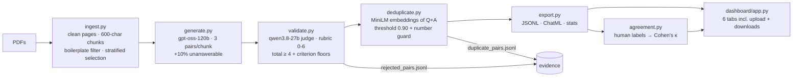
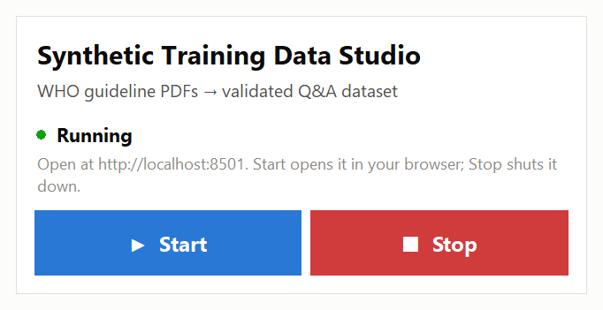
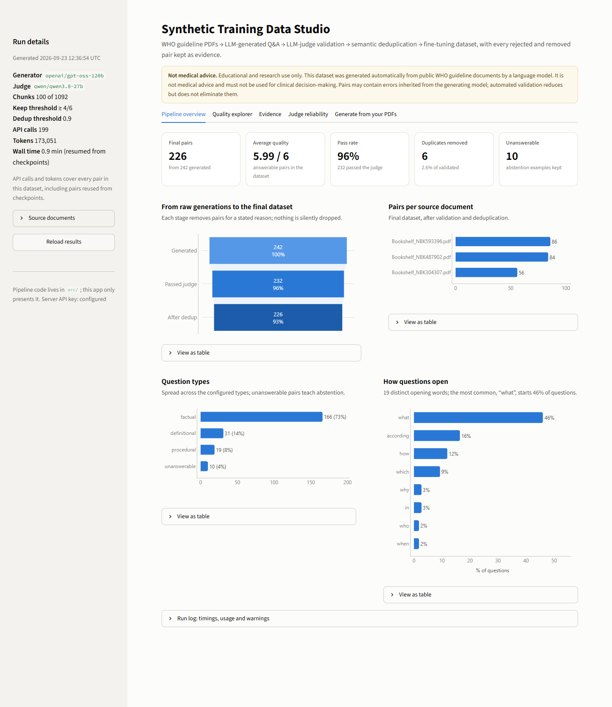
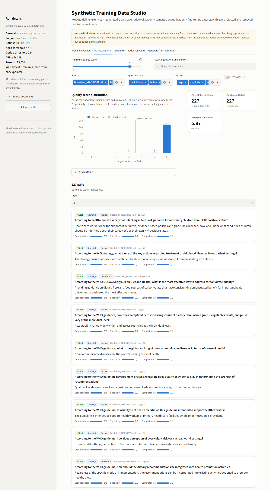
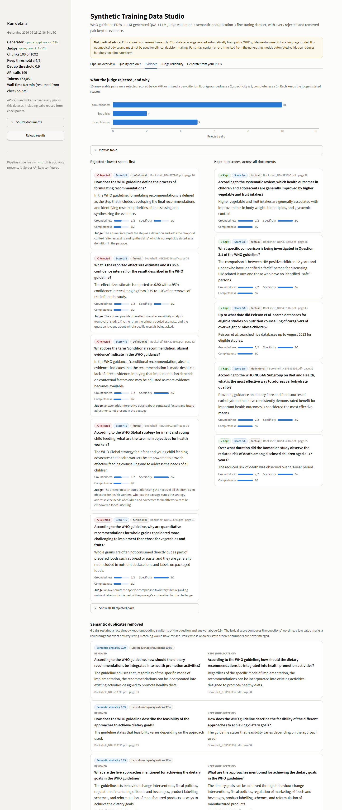
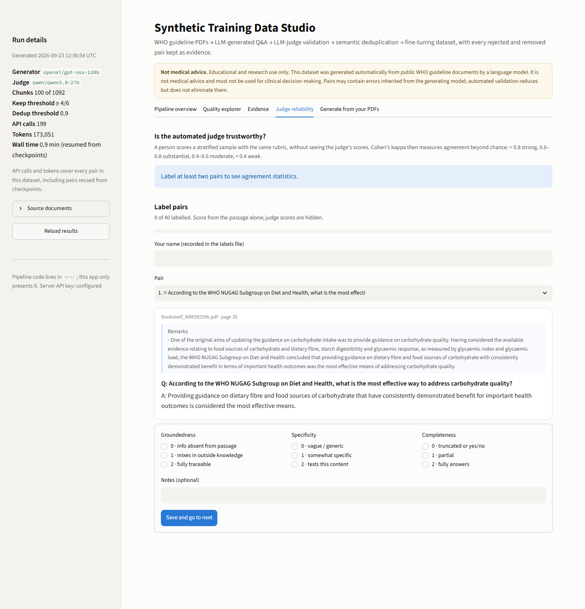
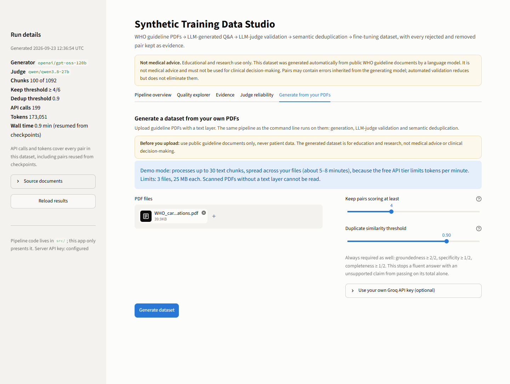
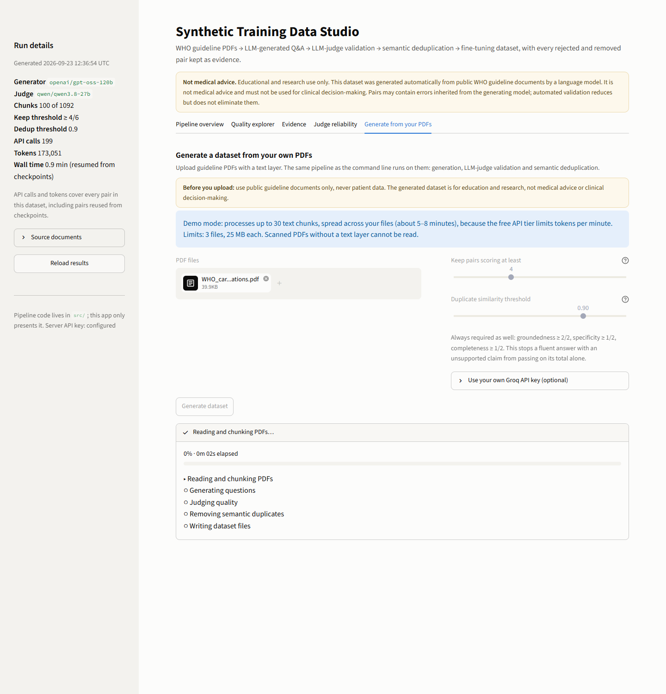
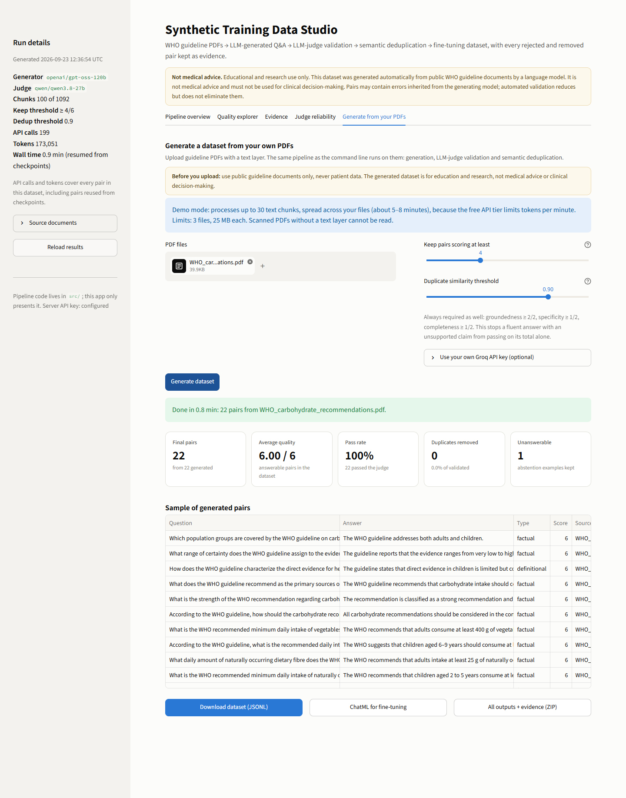
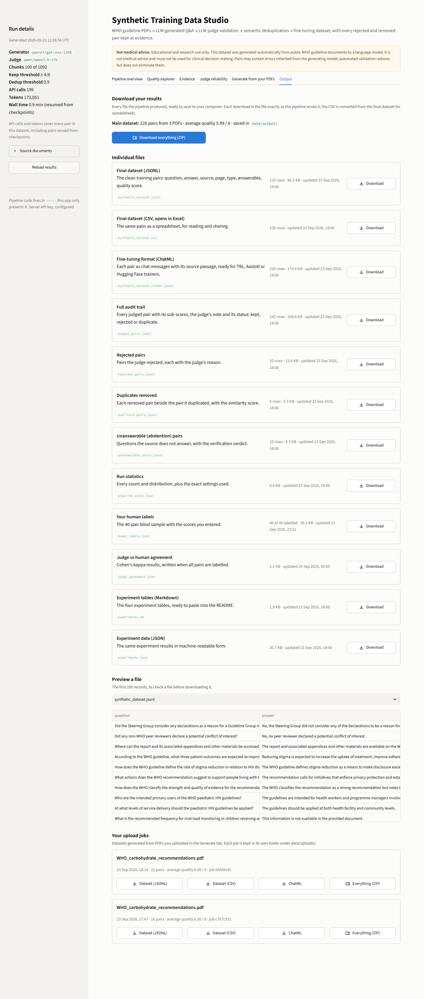

# Synthetic Training Data Generation for LLM Fine-Tuning

> **Disclaimer.** This dataset and tool are for **educational and research use only**. The question-answer pairs are generated automatically from public WHO guideline documents by a language model. They are **not medical advice** and must **not** be used for clinical decision-making. Pairs may contain errors inherited from the generating model; the validation layer reduces these errors but does not eliminate them. Only public guideline documents were used, and no patient data is involved.

A pipeline that turns domain PDFs into a validated, deduplicated question-answer dataset for supervised fine-tuning. It then **measures** what its quality control did: rejected and duplicate pairs are kept as evidence, the automated judge is checked against a human, and every threshold is tested in an experiment. A Streamlit app shows the results and lets anyone upload their own PDFs and download a dataset.

```
PDFs → clean chunks → LLM generates Q&A → LLM judge scores → semantic dedup → JSONL + statistics → dashboard + upload app
```

Organisations that want a domain assistant usually have documents but no labelled training data, and writing thousands of Q&A pairs by hand does not scale. This project automates both the generation and the quality control, and reports how well the quality control actually worked.

---

## Results (100-chunk run on three WHO guidelines)

| Stage | Count | Notes |
|---|---|---|
| Pages with text | 228 | 3 PDFs, 235 pages |
| Usable chunks | 1,092 | 354 raw splits dropped as boilerplate or fragments (see [Design decisions](#design-decisions)) |
| Chunks processed | 100 | spread across all three documents (20 / 39 / 41) |
| Raw pairs generated | **242** | 232 answerable + 10 unanswerable; 22 chunks had no substantive content |
| Passed the judge | **232** (95.9%) | 10 rejected, all for groundedness below 2/2 |
| After deduplication | **226** (93.4% of raw) | 6 restatements of an already-kept fact removed |
| Unanswerable (abstention) pairs | 10 | all 10 verified as unanswerable and on-topic |
| Average quality (final, answerable) | 5.995 / 6 | all judged answerable pairs: 5.92 |
| Mean sub-scores (all judged) | groundedness 1.96 · specificity 1.99 · completeness 1.97 | |
| Cost | 199 API calls · 94.7k generator + 78.4k judge tokens | Groq free tier |
| Judge vs human (Cohen's κ) | **pending human labels** | see [Judge reliability](#3-judge-reliability) |

Final dataset by source: carbohydrate guideline 86, child overweight/obesity guideline 84, HIV-disclosure guideline 56. By type: 166 factual, 31 definitional, 19 procedural, 10 unanswerable.

**Compared with the spec's expected results** (about 300 raw, 70% pass, about 180 final, average 4.5–5.0): this run produced fewer raw pairs (242), because 22 of the 100 chunks held no substantive content even after boilerplate filtering. The pass rate (96%) and average score (5.99) are much higher. Part of that is real: a stronger generator, a stricter prompt, and filtering out reference lists and committee rosters before generation. Part may be judge leniency. The score distribution sits at a ceiling (221 of 232 pairs at 6/6), and a spot check found a pair scored 6/6 that turned the passage's "priority *may vary*" into "authorities *should adjust*". The human-agreement study (experiment 3) exists to measure exactly this. Until it is done, read the quality numbers as the judge's opinion, not as established fact.

### Source documents (public WHO guidelines, NCBI Bookshelf)
| File | Guideline | Pages |
|---|---|---|
| `Bookshelf_NBK304307.pdf` | Guideline on HIV disclosure counselling for children up to 12 years of age (2011) | 47 |
| `Bookshelf_NBK487902.pdf` | Assessing and managing children at primary health-care facilities to prevent overweight and obesity in the context of the double burden of malnutrition (2017) | 88 |
| `Bookshelf_NBK593396.pdf` | Carbohydrate intake for adults and children (2023) | 100 |

---

## Architecture



- **`src/pipeline.py` is the only pipeline implementation.** The CLI (`main.py`) and the upload tab call the same `run_pipeline()` function. `src/` never imports Streamlit, and the dashboard never reimplements pipeline logic.
- **`src/llm.py`** holds everything that generation and judging share: the Groq client, a rate limiter that paces requests under the free-tier token limits, retries with 1 s / 2 s / 4 s backoff, JSON extraction that tolerates code fences and surrounding prose, and immediate failure (with a clear message) on a bad key, an unknown model id or an exhausted daily quota.
- **Checkpoints** make every run resumable (`--resume`). A fingerprint of the chunk set, prompt version and settings ensures a checkpoint is only reused by an identical run.

```
config.yaml              every tunable value (validated schema; dotted overrides)
main.py                  CLI
src/config.py            loads config.yaml + .env, fails loudly on problems
src/ingest.py            PDF → cleaned pages → chunks
src/llm.py               shared Groq plumbing
src/generate.py          chunk → Q&A pairs (+ unanswerable)
src/validate.py          LLM-as-judge
src/deduplicate.py       semantic dedup + diversity statistics
src/export.py            JSONL, ChatML, stats, Hugging Face upload
src/agreement.py         human-labelling sample + Cohen's kappa
src/experiments.py       Task 11 experiments (offline)
src/pipeline.py          run_pipeline(): the shared engine
src/uploads.py           upload validation and per-job folders
dashboard/app.py         Streamlit app
launcher.py              Start / Stop desktop control panel (+ desktop shortcut)
tests/test_pipeline.py   42 offline tests
requirements.txt         pinned runtime packages (Windows + Linux, CPU-only torch)
requirements-dev.txt     the same plus pytest
```

### Output files (`data/output/`)
| File | Contents |
|---|---|
| `synthetic_dataset.jsonl` | the final dataset: `question, answer, source, page, question_type, answerable, quality_score` |
| `synthetic_dataset_chatml.jsonl` | the same pairs as `{"messages": [...]}` for SFT, with the source passage in the user turn |
| `judged_pairs.jsonl` | audit trail: every judged pair with sub-scores, judge note and status (kept / rejected / duplicate) |
| `rejected_pairs.jsonl` | judge rejections with the stated reason |
| `duplicate_pairs.jsonl` | each removed pair beside the pair it duplicated, with the similarity |
| `unanswerable_pairs.jsonl` | abstention examples with their verification verdict |
| `pipeline_stats.json` | every count and distribution, plus the config used |
| `human_labels.json` | blind labelling sample for judge validation |
| `experiments.json` / `.md` | Task 11 results |

---

## Setup

Requirements: Windows (tested) or Linux x86_64 (the deployment target), Python 3.12, **no GPU**. The language model runs remotely on Groq; the only local model is the 90 MB embedding model, which runs on the CPU.

```powershell
py -3.12 -m venv venv
venv\Scripts\activate
pip install -r requirements-dev.txt      # pinned, CPU-only torch, plus pytest
copy .env.example .env                    # then put your key from https://console.groq.com/keys in .env
```

**Easiest way to run it:** double-click **Synthetic Data Studio** on the desktop (or `Start Synthetic Data Studio.bat` in the project folder). A small window opens with two buttons: **Start** opens the project in your browser, launching it first if it is not running, and **Stop** shuts it down. Stop asks for confirmation only while a dataset is being generated. No terminal is needed. To recreate the shortcut, run `venv\Scripts\python.exe launcher.py --make-shortcut`.



Inside the dashboard, the sidebar's **Generate the dataset** panel builds the dataset from `data/raw/`. **Stop generating** halts safely after the current step, and the next **Generate dataset** continues from saved progress.

From a terminal instead, put PDFs in `data/raw/`, then:

```powershell
python main.py --max-chunks 5            # smoke test (~1 min)
python main.py                           # 100 chunks (~25 min on the free tier)
python main.py --resume                  # continue an interrupted run
streamlit run dashboard/app.py --server.address localhost   # full dashboard on this computer
pytest -q                                # 42 tests, offline, no API key needed
python -m src.experiments                # experiment tables from the last run
```

Without `--server.address localhost`, Streamlit listens on every network interface and the dashboard starts in **public mode** (next section). The desktop launcher always uses localhost.

Other CLI options: `--min-quality-score`, `--similarity-threshold`, `--set section.key=value` (any config value), `--refill` (after a prompt upgrade, regenerate only incomplete chunks), and `--push-to-hub user/repo` (explicit only, private by default, uploads a dataset card that includes the disclaimer).

**Before a run, check the model ids.** Groq renames models: `llama-3.3-70b-versatile`, which the original spec named, is no longer served. Verify with `GET https://api.groq.com/openai/v1/models` and edit `model.id` / `model.judge_id` in `config.yaml`. An unknown id stops the run straight away with a clear message.

---

## Deploy (Streamlit Community Cloud)

**Public mode** makes the dashboard safe to put on the internet. It switches on automatically unless the server listens only on this computer **and** the page is opened on this computer (`web.public_mode: auto` in `config.yaml`), so a deployment is safe without any setting to remember:

| Visitors can | Visitors cannot |
|---|---|
| explore every tab of the finished run and download every file | re-run the pipeline or overwrite the committed results |
| read the judge-agreement results once the human labelling is complete | see or change the human labels |
| generate a dataset from their own PDFs **with their own Groq key**, held in their browser session only | use the server's API key (none is needed on the server) |
| download their own upload job | see anyone else's upload jobs |

To deploy:

1. Push the project to a GitHub repository. `.gitignore` keeps `.env`, `venv/`, checkpoints and upload jobs out. `data/output/` **is** committed, because it is the run that visitors see.
2. On [share.streamlit.io](https://share.streamlit.io), create an app from that repository with main file path `dashboard/app.py`.
3. Under **Advanced settings**, choose **Python 3.12**: the pinned CPU-only PyTorch builds are for 3.12. Leave **Secrets** empty, because public mode never uses a server key.
4. Deploy. The first build downloads PyTorch and takes several minutes. The first page load then downloads the 90 MB embedding model.

Notes:
- Files created on the server (visitors' upload jobs) are temporary and disappear when the app restarts.
- To publish a new run: run it locally, commit `data/output/`, and push.
- The app needed about 610 MB of memory once PyTorch and the embedding model were loaded (measured on Windows).

---

## Dashboard

`streamlit run dashboard/app.py`. The disclaimer is shown on every tab. The spec's five tabs are followed by a sixth, **Output**, for downloads.

| | |
|---|---|
| **1. Pipeline overview**: metric cards, funnel, pairs per source, question types, opening-word diversity |  |
| **2. Quality explorer**: score histogram, minimum-score slider (shown at 5), search and filters, cards with sub-scores and passages |  |
| **3. Evidence**: rejections with the judge's reasons, kept examples, duplicates side by side, unanswerable examples, downloads |  |
| **4. Judge reliability**: a blind labelling form, then per-criterion Cohen's κ, the keep/reject confusion matrix and a plain-language verdict |  |
| **5. Generate from your PDFs**: upload (3 files, 25 MB each), settings, live progress, results and downloads |  |
| Upload flow: running |  |
| Upload flow: finished (1-page excerpt of the carbohydrate guideline: 7 chunks → 22 pairs in 48 s) |  |
| **6. Output**: download everything as one ZIP, or any single file (JSONL, a CSV that opens in Excel, ChatML, audit and evidence files, statistics, labels, experiment tables), with a preview; plus every upload job's results |  |

Upload jobs run in a background thread with their own `data/uploads/<uuid>/` folder, so clicking elsewhere in the app never interrupts a job and concurrent users never collide. Demo mode caps a job at 30 chunks (about 5–8 minutes under the free-tier token limit), and the app says so before you upload. Each file is checked for size, count and a real `%PDF` signature. Scanned PDFs without a text layer are reported by name instead of producing empty output. A user can supply their own Groq key for a job; it is held in the browser session only, never written to disk or logged.

---

## Experiments

All four experiments are computed offline from `judged_pairs.jsonl` (`python -m src.experiments`). The judge scored every pair once, independently of any threshold, so each comparison applies different thresholds to the **same** scores.

### 1. Quality threshold sensitivity

| Keep rule | Min score | Kept | % of judged | After dedup | Avg quality | Kept with groundedness < 2 |
|---|---|---|---|---|---|---|
| total only (spec) | ≥ 3 | 232 | 100% | 226 | 5.922 | 10 |
| total only (spec) | ≥ 4 | 230 | 99% | 224 | 5.948 | **8** |
| total only (spec) | ≥ 5 | 227 | 98% | 221 | 5.974 | 5 |
| total only (spec) | ≥ 6 | 221 | 95% | 215 | 6.000 | 0 |
| total + floors (used) | ≥ 3 | 222 | 96% | 216 | 5.995 | 0 |
| total + floors (used) | ≥ 4 | 222 | 96% | 216 | 5.995 | **0** |
| total + floors (used) | ≥ 5 | 222 | 96% | 216 | 5.995 | 0 |
| total + floors (used) | ≥ 6 | 221 | 95% | 215 | 6.000 | 0 |

The spec's rule (a total of at least 4) would admit **8 pairs whose answers the judge found partly unsupported** by the passage. The per-criterion floors remove all of them at almost no cost in size. Because the scores sit at a ceiling, the total threshold itself makes little difference on this data. With a weaker generator it would matter more.

**Planted-defect test.** The judge was given one real pair and four deliberately broken ones built from the same passage:

| Planted pair | Judge scores (G/S/C) | Total-only rule (≥ 4) | With floors |
|---|---|---|---|
| Real pair | 2/2/2 | kept ✓ | kept ✓ |
| Answer adds a claim not in the passage | 0/2/2 | **kept ✗** | rejected ✓ |
| Wrong effect size and study count | 0/2/2 | **kept ✗** | rejected ✓ |
| Vague question ("What did the researchers find?") | 2/0/1 | rejected ✓ | rejected ✓ |
| Bare "Yes." answer | 2/2/0 | **kept ✗** | rejected ✓ |

On a repeat run at temperature 0, the judge gave identical sub-scores for all 5 pairs. The same test with `gpt-oss-120b` as judge (the generator's own model family) gave the bare "Yes." a perfect 6/6 and let the added claim pass with a total of 4. That result is why the judge is a different model family.

### 2. Deduplication sensitivity

| Setting | Threshold | Input | Removed | Survivors | Removed % |
|---|---|---|---|---|---|
| question only (spec) | 0.75 | 232 | 73 | 159 | 31.5% |
| question only (spec) | 0.80 | 232 | 42 | 190 | 18.1% |
| question only (spec) | 0.85 | 232 | 27 | 205 | 11.6% |
| question only (spec) | 0.90 | 232 | 18 | 214 | 7.8% |
| question only (spec) | 0.95 | 232 | 6 | 226 | 2.6% |
| question + answer, number guard (used) | 0.75 | 232 | 48 | 184 | 20.7% |
| question + answer, number guard (used) | 0.80 | 232 | 27 | 205 | 11.6% |
| question + answer, number guard (used) | 0.85 | 232 | 11 | 221 | 4.7% |
| **question + answer, number guard (used)** | **0.90** | 232 | **6** | **226** | 2.6% |
| question + answer, number guard (used) | 0.95 | 232 | 2 | 230 | 0.9% |

Counts alone cannot show whether a removal was right; the removed pairs have to be read. At the spec's setting (question only, 0.85), the lowest-similarity removals were distinct facts:

| Similarity | Removed | "Duplicate of" | Verdict |
|---|---|---|---|
| 0.850 | age range in the review by Peirson et al. (2015) → 0–18 years | age range in the study by Laws et al. (2014) → 0–5 years | different study, different answer |
| 0.853 | outcomes to measure for nutrition counselling | population targeted by that recommendation | different question |
| 0.879 | variables adjusted for in Fang et al. | psychological outcomes assessed in Fang et al. | different question |
| 0.874 (upload test) | daily fibre intake for children aged 2–5 years | daily fibre intake for adults (25 g) | different population and dose |

In the 1-page upload test, the spec's setting removed 6 of 22 pairs, and **all 6 were distinct facts**, including the age-specific fibre and fruit-and-vegetable recommendations. With the setting used here it removed none. At 0.90 the setting used removes only restatements: the same sentence in the guideline body and its annex, "the approaches" vs "the five approaches", and the same evidence-quality rating asked two ways.

### 3. Judge reliability

Pending: **this needs a person.** A blind, stratified sample of 40 pairs is ready in `data/output/human_labels.json`. The judge's scores are not in the file. Because scores cluster at 6, the stratification includes every pair the judge scored below 6: 2 at 3/6, 3 at 4/6 and 6 at 5/6, plus 29 at 6/6. Score them in dashboard tab 4 (or edit the JSON), then run:

```powershell
python -m src.agreement score     # prints κ per criterion and for keep/reject
python -m src.experiments         # refreshes data/output/experiments.md
```

and paste the resulting table here. Interpretation bands: > 0.8 strong, 0.6–0.8 substantial, 0.4–0.6 moderate, < 0.4 weak. **If agreement is weak, say so here and down-weight the judge-based numbers above.** Cohen's κ is reported unweighted as the headline figure, and linear-weighted as a secondary figure because the 0/1/2 scale is ordinal. With only a handful of pairs below 6, the keep/reject κ will have a wide confidence interval, so report it together with the confusion matrix.

### 4. Question-type and opening-word diversity

| | Before dedup | After dedup |
|---|---|---|
| factual | 169 | 166 |
| definitional | 33 | 31 |
| procedural | 20 | 19 |
| unanswerable | 10 | 10 |
| distinct opening words | 19 | 19 |
| most common opening | "what" 46% | "what" 46% |

The dataset leans factual (77% of answerable pairs), which reflects the source material. The prompt tells the model to tag each pair with the type it truly is rather than forcing one factual, one definitional and one procedural question per chunk. An earlier prompt version did force that split, and it produced mislabelled "procedural" questions. "According to the WHO guideline…" opens 16% of questions (see [Limitations](#limitations)).

---

## Design decisions

**Why 600-character chunks with 80 overlap.** About 150 words is enough for two or three specific questions and small enough that questions stay precise. The 80-character overlap keeps a sentence that straddles a boundary whole in at least one chunk. Chunks never cross a page, so every pair's `page` citation is exact. Page text is cleaned first: running headers, page numbers and icon-font glyphs are removed, lines broken mid-sentence are rejoined, and typesetting hyphen breaks ("carbo - hydrate") are repaired.

**Why filter boilerplate before generation.** Reference lists, committee rosters, contents pages and licence text are "grounded" text, so a judge would pass questions such as "Which university is Paul Montgomery from?". Six cheap text signals (citation markers, author-initial patterns, legal phrases, contents entries, share of capitalised words, share of numeric tokens) removed 311 of 1,446 splits, and 43 more were fragments under 100 characters. The thresholds were calibrated on these documents: none of the removed chunks that mention "recommend", "should" or "disclosure" were real guideline prose. The generator can still return `[]` for a passage with no substantive content, which it did for 22 of 100 chunks.

**Why stratified chunk selection.** Taking the first 100 chunks would have used one PDF, mostly its front matter. Instead the 100-chunk budget is split across documents in proportion to their size, and chunks are taken evenly spaced within each. The selection is deterministic.

**Why temperature 0.4 for generation and 0.0 for judging.** At 0.7 and above, questions become more creative but hallucinations increase; at 0.1, phrasing becomes repetitive. Judging must be reproducible, and the repeat-run check above gave identical scores.

**Why a different model family as judge.** An LLM judge tends to favour its own model's style (self-preference bias). The measured result in the planted-defect table decided the choice. It also gives the judge its own per-model rate limit and daily quota.

**Why keep-threshold 4 plus floors.** Four out of 6 means at least two criteria are fully met; stricter thresholds (5–6) discard usable pairs and looser ones (2–3) admit noise. But a total alone accepts 2+2+0, so the pipeline also requires groundedness 2/2 and at least 1/2 on each of the other criteria. For medical training data, an answer the passage does not support is not acceptable, however fluent it is.

**Why unanswerable questions.** A model trained only on answerable questions learns that every question has an answer, and hallucinates when it does not know. Ten percent of chunks also produce a plausible, on-topic question that the passage does not answer, paired with the fixed answer *"This information is not available in the provided document."* That answer is set in code, and the judge verifies that the question really is unanswerable and on topic. Because abstention only makes sense relative to a document, the ChatML export puts the source passage in the user turn.

**Why question + answer embeddings, 0.90, and a number guard for dedup.** A duplicate is a pair that teaches the *same fact*. The questions this pipeline writes are deliberately specific and self-contained, so two questions about one recommendation share most of their words even when they ask different things. Question-only similarity therefore scored distinct facts at 0.85–0.94. Adding the answer brings them down to 0.65–0.87, below the threshold, while real restatements stay at 0.90–0.99. MiniLM barely registers digits: hazard ratios of 3.4, 4.7 and 12.3 for different child groups scored 0.99. So two pairs whose answers state different numbers are never merged. When two pairs are duplicates, the higher-scored one is kept.

**Why these token caps and pacing.** Free-tier Groq allows 8,000 tokens per minute and 200,000 per day per model. It admits a request only if `prompt + max_tokens` fits in the remaining minute budget, so the original 2,048-token cap throttled every call. With the caps set from measured maxima (1,024 for generation, 512 for the judge), throughput rose from about 6 to about 8–12 chunks per minute. Judging all pairs from one chunk in a single call sends the passage and rubric once, and each pair still gets its own independent scores.

---

## Changes from the original specification

| Spec | This implementation | Reason |
|---|---|---|
| `llama-3.3-70b-versatile` | generator `openai/gpt-oss-120b`, judge `qwen/qwen3.8-27b` | the Llama model is no longer served; separate judge family measured to be stricter |
| keep if total ≥ 4 | total ≥ 4 **and** groundedness 2, specificity ≥ 1, completeness ≥ 1 | the total alone kept planted hallucinations |
| dedup on question embeddings at 0.85 | question + answer embeddings at 0.90 + number guard | the spec setting removed distinct facts (experiment 2) |
| fail at import if `GROQ_API_KEY` is missing | fail at the start of any run that needs the API | the tests must run with no key, and the dashboard must display results without one |
| first N chunks | boilerplate filter + stratified selection | the first 100 chunks would be one PDF's front matter |
| one judge call per pair | one call per chunk, independent scores per pair | about half the judge tokens under the 8k tokens/minute cap |
| ChatML is question → answer | the passage is included in the user turn | abstention examples require the document |
| — | extra files: `judged_pairs.jsonl`, `synthetic_dataset_chatml.jsonl`, `experiments.*`; modules `llm.py`, `uploads.py`, `experiments.py` | audit trail, shared code, testable upload checks |

**Prompt revision during the run.** The first generation prompt (gen-v2) dropped any pair whose question referred to "the passage". That silently discarded good pairs, and 26 chunks returned nothing. Version gen-v3 rewrites such references to "the WHO guideline" instead of dropping the pair. Because of Groq's daily token cap, the 49 chunks that had yielded fewer than 3 pairs were regenerated with gen-v3 (`--refill`), and the 51 complete chunks were kept from gen-v2. Each pair records its prompt version: 158 pairs come from gen-v2 and 84 from gen-v3. The two versions share the same extraction rules; only the handling of source references differs. A fresh `python main.py` run uses gen-v3 throughout.

---

## Limitations

- **Judge leniency is unmeasured until the human labels are in.** The scores sit at a ceiling, and a spot check found at least one subtle distortion (a description turned into an instruction) scored 6/6. The quality figures are the judge's view.
- **Validation reduces errors but does not remove them.** The generator can still paraphrase in ways that shift meaning, and the judge can miss that.
- **Chunk-level knowledge only.** Every pair comes from one 600-character, single-page passage. Facts that span passages, and information in tables, are under-represented. Table text extracted by pypdf is often scrambled and is mostly filtered out.
- **Style skew.** 77% of answerable pairs are factual, 46% of questions begin with "What", and 16% begin with "According to the WHO guideline" (a result of the source-reference rewrite). A fine-tuned model could pick up these patterns.
- **Heuristics calibrated on three documents.** The boilerplate filter and the dedup settings were tuned on this corpus and should be re-checked on new material. The number guard only compares numbers stated in the answers.
- **Free-tier limits.** A 100-chunk run uses about 95k generator and 80k judge tokens, close to half of each model's 200k-token daily quota. Running the whole corpus (1,092 chunks) needs several days or a paid tier. Runs resume from checkpoints.
- **The dataset mixes two prompt versions** (see above).
- **No OCR.** Scanned PDFs are detected and skipped with a warning.
- **Locally, the upload tab uses the server's API key** unless you enter your own. Public mode (see [Deploy](#deploy-streamlit-community-cloud)) never uses the server key: visitors must bring their own.
- English only.

## Future work (optional extension, not built)
Fine-tune a small model (for example Llama 3.2 3B with QLoRA in Colab) on three variants of the data: raw, validated, and validated plus deduplicated. Compare them with the base model on held-out questions. If the smallest, cleanest set performs best, the quality pipeline is justified empirically rather than asserted.

## Safety
Educational and research use only; not medical advice; not for clinical decision-making. Only public guideline documents are used, never patient data. Generated pairs can contain errors inherited from the generating model. That is precisely why the validation layer exists, and validation reduces those errors but does not eliminate them. The same disclaimer appears in the dashboard (every tab, including the upload tab before anything is uploaded) and in any dataset card pushed to the Hugging Face Hub. The source documents are © WHO, licensed CC BY-NC-SA 3.0 IGO.
