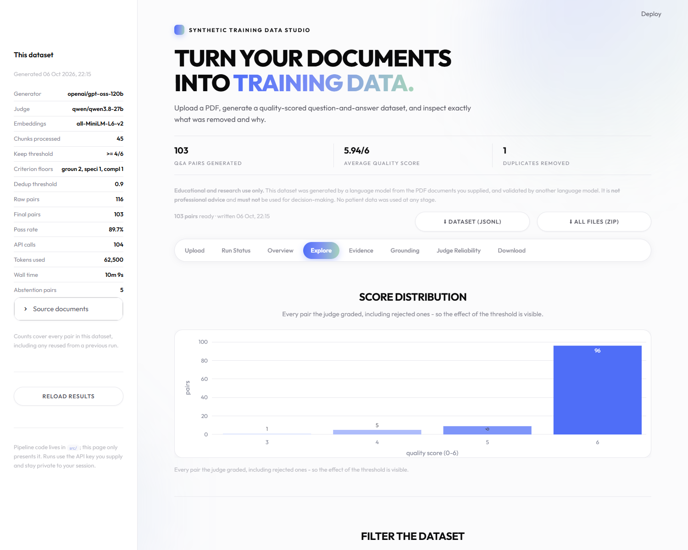
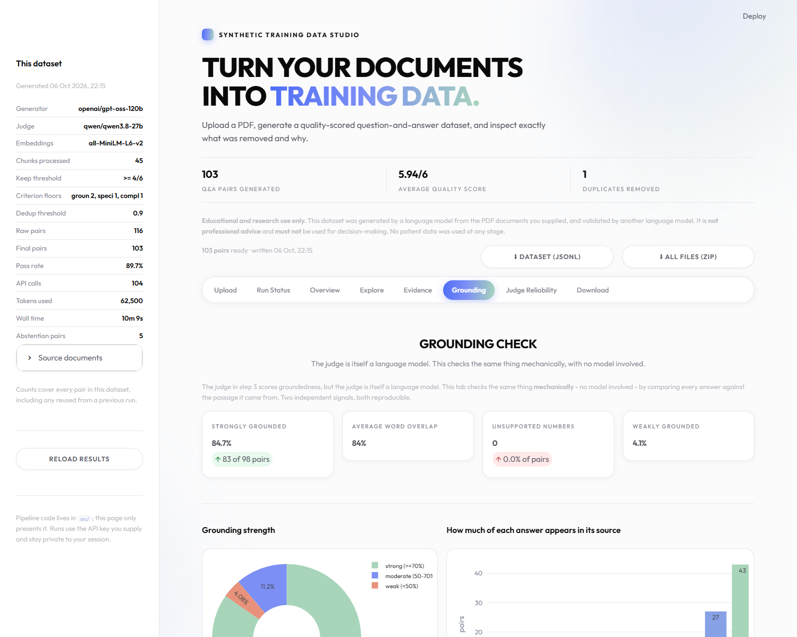
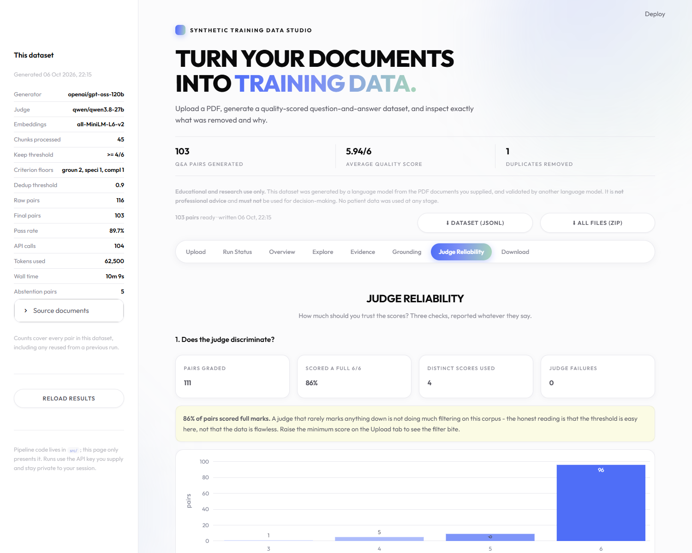

# Synthetic Training Data Generation for LLMs

Turns raw domain PDFs into a validated, deduplicated Q&A training dataset —
and a dashboard that shows *what was removed and why*.

**PDFs in → quality-scored Q&A training dataset out → dashboard proves it works.**

M.Tech (AI & Data Science) industry project. Domain-agnostic: validated on WHO
clinical guidelines, RBI regulatory circulars and an agricultural extension
handbook.

---

## ⚠️ Safety notice

> **EDUCATIONAL AND RESEARCH USE ONLY.**
> Every dataset this pipeline produces is written by one large language model
> and graded by another, from whatever documents were supplied to it. It is
> **not professional advice** and **must not** be used for decision-making.
> Answers may be incomplete, outdated or simply wrong. Always consult the
> original source document. **No personal or patient data is used at any
> stage** — only the documents you upload.

The disclaimer is generated from a single constant (`SAFETY_DISCLAIMER` in
[src/export.py](src/export.py)) and carried into the dashboard, the exported
ChatML system prompt and the HuggingFace dataset card, so they cannot drift
apart. It also **adapts to the corpus**: `looks_clinical()` detects clinical
source documents and strengthens the wording to "not medical advice, not
clinical guidance" for those runs. The run documented below is agricultural,
so the generic wording applies.

---

## The problem

Every organisation that wants a domain-specific AI assistant needs labelled Q&A
training data. They have documents but no training pairs, and creating them by
hand does not scale. This pipeline automates generation, quality validation and
deduplication — then **measures whether the cleaning actually improved the data**.

## Architecture

```
PDFs → chunks → boilerplate filter → LLM generates Q&A → LLM judge scores
                                                              ↓
                    Streamlit dashboard ← JSONL ← semantic dedup
```

| Stage | File | What it does |
|---|---|---|
| 1. Ingest | [src/ingest.py](src/ingest.py) | PDF/DOCX/TXT/MD → 600-char overlapping chunks, boilerplate removed |
| 2. Generate | [src/generate.py](src/generate.py) | Chunk → 3 Q&A pairs (factual / definitional / procedural), plus abstention examples |
| 3. Validate | [src/validate.py](src/validate.py) | LLM-as-judge (a *different* model), 3 criteria × 0–2, keep ≥ 4/6 **and** every per-criterion floor |
| 4. Deduplicate | [src/deduplicate.py](src/deduplicate.py) | MiniLM embeddings over question + answer, cosine ≥ 0.90 = duplicate, with a number guard |
| 5. Export | [src/export.py](src/export.py) | JSONL + ChatML + statistics + optional HF push |
| — | [src/budget.py](src/budget.py) | Token budget estimation and metering |
| — | [src/grounding.py](src/grounding.py) | Independent, non-LLM hallucination check |
| — | [src/runner.py](src/runner.py) | Uploads, session input, starting/stopping background runs |
| — | [src/progress.py](src/progress.py) | Progress file shared by pipeline and dashboard |
| — | [src/checkpoint.py](src/checkpoint.py) | Resume after a crash or an exhausted quota |
| — | [tests/test_pipeline.py](tests/test_pipeline.py) | 24 offline tests over the keep rule, dedup and checkpoints |
| — | [dashboard/app.py](dashboard/app.py) | 8-tab dashboard: run it, then inspect it |

---

## Quick start

**Double-click `START_HERE.bat`.** That is the whole workflow — the dashboard
opens in your browser, and everything happens there:

1. **Upload your documents** in the **1 · Upload Files** tab (1 to 8 files:
   PDF, Word, plain text or Markdown). Each is read as it lands, so an
   unsupported type, an empty file or a scanned PDF with no text layer is
   caught immediately rather than after twenty minutes of API calls.

   The pipeline runs on **those files only**. Nothing carries over between
   sessions - relaunching always starts from an empty input list, so a run can
   never quietly use documents you replaced earlier.
2. **Read the results** in the other tabs, and grab the files from
   **⬇ Downloads** when it finishes.

Note the order: you choose the **run size** (Quick ~3 min / Standard ~5 min /
Large ~9 min), the quality threshold and the duplicate similarity *before*
loading, because **loading the files starts the pipeline immediately** — there
is no separate start button. The panel shows the estimated time and token cost,
and the load button states both, so nothing is spent without being shown first.

A progress bar and live log appear as soon as the run begins, on whichever tab
you are looking at. The run happens in a separate process, so you can close the
browser and come back — and there is a Stop button if you change your mind.

First-time setup:

```bash
python -m venv venv
venv\Scripts\pip install -r requirements.txt
copy .env.example .env      # then edit it: GROQ_API_KEY=gsk_...
```

Prefer the command line? Everything is still available there:

```bash
python src/budget.py               # what will this run cost?
python main.py --max-chunks 75     # run the pipeline
streamlit run dashboard/app.py     # just the dashboard
```

Windows shortcuts: `START_HERE.bat` (dashboard), `run_pipeline.bat`,
`run_experiments.bat`.

---

## Measured results

Latest complete run: **1 agricultural extension handbook (`farmerbook.pdf`)**,
45 chunks, 2026-10-06. Every number below is read from
`data/output/pipeline_stats.json` — they are measurements, not claims.

### Generation and validation

| Stage | Count |
|---|---|
| Chunks processed | 45 |
| Raw pairs generated | 116 (2.58/chunk) — 111 answerable + 5 abstention |
| Pairs graded by the judge | 116 (**all of them**, 0 judge failures) |
| Passed the keep rule | 104 (89.7%) |
| Rejected | 12 — **all 12 on the groundedness floor** (11 of them would have passed a total-only filter) |
| Duplicates removed (cosine ≥ 0.90) | 1 (1.0%) |
| **Final dataset** | **103 pairs** (98 answerable + 5 abstention) |
| Average quality score | **5.94 / 6** (answerable pairs only) |
| Sub-scores | groundedness 2.00, specificity 1.97, completeness 1.97 |
| Score distribution | 95 pairs at 6/6, 3 at 4/6 |
| Question types | factual 46, procedural 28, definitional 24, unanswerable 5 |
| Distinct two-word openers | 56 (most common opener 14.6%) |
| Runtime | 10 min 9 s |
| Tokens used | 62,500 over 104 requests (31.3% of the daily budget) |

`run_health.complete = true` — every generated pair was graded.

**The 12 rejections are the interesting part.** All of them failed the
groundedness floor, and the judge's reasons name the specific defect:

> *"Invents Rhizobium benefit for rice"* ·
> *"Invents definition of control group not in passage"* ·
> *"Passage is truncated, answer completes the sentence"* ·
> *"answer omits 'people' and implies list is complete"*

**Eleven of the twelve scored groundedness 1, not 0** — "mostly supported, adds
a small unstated detail" — and nine of them totalled 5/6. A total-only filter at
≥ 4/6 would have admitted **11 of the 12**. That is exactly the failure mode the
per-criterion floors exist to catch: a fluent, specific, complete answer with
one invented detail in it scores well on two criteria and sails through on the
sum. On this corpus the floors are the *only* reason anything was rejected.

### Grounding (independent, non-LLM check)

No model involved — word overlap between each answer and its source passage,
plus a check for numbers that appear in the answer but not the passage.

| Measure | Value |
|---|---|
| Pairs analysed | 98 (answerable only) |
| Strongly grounded (≥ 0.7) | **84.7%** |
| Moderately grounded (0.5–0.7) | 11.2% |
| Weakly grounded (< 0.5) | 4.1% |
| Answers with unsupported numbers | **0** |
| Agreement with the LLM judge | 84.7% |

The 15% disagreement is where a human should look: 4 pairs the judge called
fully grounded scored low on word overlap, and none that the judge marked down
had high overlap.

This check matters because it is the only quality signal in the project that
does not come from a language model. When the groundedness floor was raised
from 1 to 2, strong grounding rose from 81.0% to 86.8% on the previous corpus —
an independent measurement confirming the stricter rule genuinely improved the
data, rather than the judge merely agreeing with itself.

---

## Experiments

### 1. Quality threshold sensitivity

`python experiments/threshold_sensitivity.py` — re-filters the graded pairs
offline, so it costs nothing. 111 graded pairs available; dedup held at 0.90.

| min score | floors applied | survivors | avg quality | % of graded |
|---|---|---|---|---|
| 3 | yes | 98 | 5.94 | 88.3% |
| 3 | no | 109 | 5.81 | 98.2% |
| **4 (default)** | **yes** | **98** | **5.94** | **88.3%** |
| 4 | no | 108 | 5.83 | 97.3% |
| 5 | yes | 95 | 6.00 | 85.6% |
| 5 | no | 103 | 5.92 | 92.8% |
| 6 | yes | 95 | 6.00 | 85.6% |

**The honest finding: the total threshold does almost nothing here.** Moving it
from 3 to 6 changes the dataset by three pairs. What actually filters this
corpus is the **per-criterion floors** — compare any row with floors against
the same row without: 10–11 pairs, every time, at every threshold.

That is worth stating plainly, because the obvious reading of a "≥ 4/6 quality
filter" is that the 4 is doing the work. On this corpus it is not. The floors
are, and a report that credited the threshold would be wrong.

### 2. Deduplication threshold sensitivity

`python experiments/dedup_sensitivity.py`

| cosine | survivors | removed |
|---|---|---|
| 0.75 | 95 | 4 (4.0%) |
| 0.85 | 97 | 2 (2.0%) |
| **0.90 (default)** | **98** | **1 (1.0%)** |
| 0.95 | 98 | 1 (1.0%) |

The single removal at 0.90 is a true duplicate:

> removed: *"What does the Kisan Credit Card Scheme (KCC) refer to?"*
> kept: *"What is the purpose of the Kisan Credit Card Scheme (KCC)?"* — cosine 0.951

At 0.75 the cuts become questionable — *"What does the term Good Agricultural
Practices (GAP) refer to?"* is removed as a duplicate of *"What does the acronym
GAP stand for…"* at 0.843, which is defensible, but the margin is thin.

**Why 0.90 and not the 0.85 the brief suggested.** Measured on a WHO corpus,
0.85 over questions alone merged *"At what age is the first dose given?"* with
*"When is the second dose given?"* at cosine 0.896 — two different facts
collapsed into one. Three changes fixed it: the threshold rose to 0.90, the
embedding now covers the **answer as well as the question**, and a **number
guard** refuses to merge two answers stating different numbers however similar
their wording. The dedup rate fell as a result, which is the point: the earlier
figure was partly counting real information loss as a success.

### 3. Judge reliability (Cohen's kappa) — **not yet measured**

`python experiments/judge_reliability.py` draws a fixed, seeded sample of 40
graded pairs and asks for a blind hand-score on the same 0–2 rubric; `--report`
computes the kappa. A sample has been labelled, but **the labels cannot support
a kappa**:

| criterion | κ | exact agreement |
|---|---|---|
| groundedness | n/a — no variance | 2.5% |
| specificity | n/a — no variance | 2.5% |
| completeness | n/a — no variance | 0.0% |
| keep / reject | n/a — no variance | 10.0% |

All 40 labels carry the same three scores (groundedness 0, specificity 1,
completeness 0). Kappa measures agreement *beyond chance*, and a rater who gave
every pair an identical score provides no chance-corrected scale to measure
against — so the statistic is undefined, not zero. Exact agreement of 0–2.5% is
itself the tell: random labelling on a 3-point scale would land near 33%.

The experiment now **refuses to emit a number** in this situation rather than
reporting a confident-looking `0.000`, and prints a warning naming the affected
criteria. Earlier it only did so when *both* raters were constant, which is how
a meaningless `κ = 0.000, slight agreement` reached this README's predecessor.

**This remains the project's one genuinely open item.** Until a varied blind
sample is scored, the judge's quality scores are unverified by any human, and
the honest position is to say so rather than to quote a number. The independent
grounding check in the previous section is the closest thing to external
validation currently available.

---

## Reproducing these numbers

```bash
python main.py --max-chunks 45          # resumes from checkpoint if one exists
python experiments/threshold_sensitivity.py
python experiments/dedup_sensitivity.py
python experiments/judge_reliability.py           # hand-score the sample
python experiments/judge_reliability.py --report  # then compute kappa
python -m pytest                                  # 24 offline tests
```

Generation and judging are checkpointed, so a re-run after a crash or an
exhausted daily quota resumes instead of starting over. A re-run of the above
after a completed run costs **1 API call and 578 tokens** instead of 104 calls
and 62,500 tokens. Use `--fresh` to force everything to be recomputed.


## What makes this more than a tutorial

### 1. LLM-as-judge validation with a published rubric

Three criteria, 0–2 each, total 0–6, keep ≥ 4. `temperature=0.0` so a grade is
reproducible. Every sub-score and a short `reject_reason` are stored, so the
dashboard can explain *why* a pair died.

**The judge was tested, not assumed.** Planted pairs against a known passage:

| Planted defect | Score | Groundedness | Caught? |
|---|---|---|---|
| Correct answer | 6/6 | 2 | kept ✓ |
| Invented drug dose ("300 mg once daily") | 4/6 | **0** | rejected ✓ |
| Contradicts the passage threshold | 4/6 | **0** | rejected ✓ |
| Vague "what is this about" | 4/6 | 2 | borderline |
| Truncated answer | 3/6 | 2 | rejected ✓ |
| Answer unrelated to question | 0/6 | 0 | rejected ✓ |

**This test changed the design.** The hallucinated-dose and contradiction pairs
both scored **exactly 4/6** — they would have *passed* a total-only threshold
and entered a medical dataset. So the keep rule gained **per-criterion floors**
on top of the total (`MIN_CRITERION_SCORES` in [src/validate.py](src/validate.py)):

```python
{"groundedness": 2, "specificity": 1, "completeness": 1}
```

Groundedness sits at the strict 2 of 2, because "mostly supported, adds a small
unstated detail" *is* the failure that matters — the unstated detail is the
invented dose. The measured run above justifies it: 11 of the 12 rejected pairs
scored groundedness 1 and would otherwise have been kept.

One rule, written once. `keep_decision()` is imported by validation, the
threshold experiment and the human-versus-judge comparison, so the three cannot
drift into measuring different things.

### 2. Semantic deduplication, not string matching

`all-MiniLM-L6-v2`, `normalize_embeddings=True` so a dot product *is* cosine
similarity. Verified on planted rewordings:

| Removed | Kept as original | Cosine |
|---|---|---|
| "At what CD4 count is a patient considered to have advanced HIV disease?" | "What is the CD4 threshold for advanced HIV disease?" | **0.911** |
| "What is the recommended treatment for cryptococcal meningitis in HIV-positive adults?" | "How should cryptococcal meningitis be treated in adults living with HIV?" | **0.927** |

These share few exact tokens — string matching or fuzzy matching would keep
both. Only embeddings catch them. A genuinely distinct question about HPV
genotypes in the same batch was correctly **kept**.

**But embeddings alone over-merge, and that had to be fixed.** At cosine 0.85
over the question only, *"At what age is the first dose given?"* and *"When is
the second dose given?"* scored 0.896 and one was deleted — two different facts
collapsed into one. Three changes, all visible in the sensitivity table above:

- threshold raised to **0.90**
- the **answer is embedded alongside the question**, because that is where the
  distinguishing detail usually lives
- a **number guard**: two answers stating different numbers are never merged,
  however similar their wording (25 g for adults vs 15 g for children stay apart)

The dashboard shows the **lexical overlap** beside the cosine score for every
removed pair. A duplicate at 0.95 cosine and 0.40 lexical is the evidence for
this whole design choice, stated as a measurement rather than a claim.

### 3. Boilerplate filtering (found by inspecting real output)

The first test run produced questions like *"Who holds the ownership component
in the work described in the WHO disclaimer?"* and *"What do dotted and dashed
lines on maps represent?"* — grammatical, well-formed, and worthless.

A WHO guideline is ~26% front matter, bibliography, contents and acknowledgements. Two
layers now remove it: a chunk-level filter in `ingest.py` and a question-level
filter in `generate.py`. Every pattern was checked against real dropped and kept
samples to keep false positives near zero — an early, looser heuristic wrongly
dropped genuine clinical evidence text (`"(RR 0.84; 95% CI 0.71–0.99) (106)"`)
and was replaced with a stricter name-affiliation pattern. Contents pages are
detected by their dot leaders (`Acknowledgements ....... iv`) rather than by
heading text, because an "Abbreviations" glossary and an "Executive summary"
are genuine content that a heading rule would discard.

This also saves ~26% of the API budget, which matters a great deal here.

### 4. An independent hallucination check that does not use a model

The judge scores groundedness — but the judge is itself a language model, and
"we asked a model to mark another model's homework" is the first thing an
examiner will press on. So [src/grounding.py](src/grounding.py) checks the same
thing **mechanically**, with no model involved:

- **Lexical overlap** — what share of the answer's content words appear in the
  source passage.
- **Unsupported numbers** — numbers in the answer that appear nowhere in the
  source. This is the sharp one: prose can be legitimately paraphrased, a dose
  or a threshold cannot.

Validated against planted answers on a known passage:

| Planted answer | Overlap | Unsupported numbers | Verdict |
|---|---|---|---|
| Correct restatement | 0.86 | — | grounded ✓ |
| Invented dose "300 mg once daily" | 0.20 | **300** | caught ✓ |
| Wrong threshold ("above 7" not "above 3") | **1.00** | **7** | caught ✓ |
| Heavy paraphrase, no new facts | 0.00 | — | flagged, but legitimate |

The third row is the point: **every word matched**, so word overlap alone called
it perfectly grounded — only the number check caught the fabricated threshold.
The two signals are complementary, and neither is sufficient alone.

Measured on the 103-pair dataset above: **84.7%** strongly grounded, 11.2%
moderate, 4.1% weak, and **0 answers containing a number absent from their
source**. It agrees with the LLM judge on 84.7% of pairs; the 15% where they
disagree is exactly the set a human reviewer should look at first.

The check earns its place by being independent. When the groundedness floor was
raised from 1 to 2, strong grounding rose from 81.0% to 86.8% on the corpus
measured at the time — a confirmation from outside the model that the stricter
rule improved the data, rather than the judge simply agreeing with itself.
It is a triage tool that tells a human where to look, not an oracle.

Grounding also varies by question type: definitional questions ground weakest
(**0.62**) against factual (0.73) and procedural (0.74), because a definition
forces the model to explain in its own words.

### 5. Visible evidence

The dashboard shows what was rejected and why, and displays each removed
duplicate beside the question it duplicated with its similarity score. Rejected
pairs are kept deliberately — they are evidence, not waste. Judge failures are
counted **separately** from quality rejections so a quota outage can never
masquerade as a quality signal.

---

## The real constraint: token budget

The binding limit is not compute — it is the Groq free tier:

| Limit | Value | Visible in headers? |
|---|---|---|
| Requests / day | 1,000 | yes |
| Tokens / minute | 8,000 | yes |
| **Tokens / day** | **200,000** | **no — only inside the 429 body** |

Because the daily token cap is invisible until you hit it, the pipeline
estimates before spending and meters as it goes
([src/budget.py](src/budget.py)):

```
 chunks   pairs     tokens   % day  requests   min run
     25      75     48,500   24.2%        50      6.1m
     50     150     97,000   48.5%       100     12.1m
     75     225    145,500   72.8%       150     18.2m
    100     300    194,000   97.0%       200     24.2m
    799   2,397  1,550,060  775.0%      1598    193.8m   <- full corpus: ~8 days
```

Two changes make a full run fit:

- **Batched judging.** Pairs from one chunk share a passage, so all three are
  graded in one call. The 800-char context and ~350-token rubric are sent once
  instead of three times: ~970 tokens instead of ~2,070, a **53% saving** on the
  judging stage.
- **Header-aware backoff.** Groq's 429 says *"try again in 4m24.383s"*. The
  retry honours that exact figure instead of guessing — guessing short burns
  requests against the daily cap, guessing long wastes hours.

`--max-chunks 75` is the default because it uses ~73% of a day's tokens, leaving
headroom for retries.

---

## Output files

| File | Purpose |
|---|---|
| `synthetic_dataset.jsonl` | The deliverable. `question`, `answer`, `source`, `page`, `question_type`, `answerable`, `quality_score` |
| `synthetic_dataset_chatml.jsonl` | Same data as `messages` for SFTTrainer, with the safety system prompt |
| `rejected_pairs.jsonl` | What the judge threw out, with sub-scores and reason |
| `duplicate_pairs.jsonl` | What dedup removed, beside what it duplicated, with similarity |
| `graded_pairs.jsonl` | Every graded pair with sub-scores — feeds the experiments |
| `grounding_analysis.jsonl` | Per-pair overlap, novel words and unsupported numbers |
| `unanswerable_pairs.jsonl` | Abstention examples with the judge's verdict on each |
| `pipeline_stats.json` | Every number the dashboard reads, including what the run cost |
| `experiment_*.json` | Threshold, dedup and judge-reliability results |
| `data/cache/*_checkpoint.jsonl` | Resume state (gitignored, not a result) |

Internal fields (`chunk_text`, the raw `scores` dict) are stripped before
export; `src/export.py` asserts this on every run.

---

## Environment

| Item | Value |
|---|---|
| OS | Windows 11 |
| Python | 3.12.7 |
| GPU | none — CPU-only throughout |
| Generator | `openai/gpt-oss-120b` via Groq |
| Judge | `qwen/qwen3.8-27b` via Groq — deliberately a different family, to avoid self-preference bias |
| Embeddings | `all-MiniLM-L6-v2`, CPU |

**Model note.** The project brief named `llama-3.3-70b-versatile`. That model no
longer exists on this account — a live `client.models.list()` on 2026-09-02
returned no Llama chat models at all. The id is defined as a single constant
(`GROQ_MODEL` in [src/config.py](src/config.py)); run `python src/config.py` to
print the live model list and the current key status.

**LangChain note.** This project runs LangChain 1.3.18, where
`langchain.text_splitter` no longer exists. The splitter is imported from
`langchain_text_splitters`.

**Encoding note.** WHO PDFs contain non-breaking hyphens (U+2011) and curly
quotes. Windows consoles default to cp1252 and `print()` dies on them, so every
entry point calls `use_utf8_console()`.

**Virtual environment.** The venv currently lives at
`../venv` (one level above this folder), shared with sibling projects. It is
*outside* the project, so zipping this folder will not include it — recreate it
from `requirements.txt`.

---

## Repository layout

```
.
├── data/
│   ├── raw/                    uploaded documents (emptied each session)
│   ├── cache/                  resume checkpoints (gitignored)
│   └── output/                 generated artefacts (gitignored)
├── src/
│   ├── config.py               paths, model constant, key loading, UTF-8 fix
│   ├── ingest.py               PDF → chunks + boilerplate filter
│   ├── generate.py             chunk → Q&A pairs
│   ├── validate.py             LLM-as-judge (batched)
│   ├── deduplicate.py          semantic dedup + diversity stats
│   ├── export.py               JSONL, ChatML, stats, HF push
│   ├── budget.py               token estimation and metering
│   ├── grounding.py            non-LLM hallucination check
│   ├── runner.py               document uploads + background run control
│   ├── progress.py             progress file shared with the dashboard
│   └── checkpoint.py           fingerprinted resume for generate and judge
├── dashboard/
│   ├── app.py                  8-tab Streamlit dashboard (upload + run + inspect)
│   └── theme.py                design tokens and CSS
├── experiments/                threshold, dedup and judge-reliability studies
├── tests/test_pipeline.py      24 offline tests (no API calls)
├── docs/                       dashboard screenshots
├── main.py                     runs the whole pipeline
├── START_HERE.bat              double-click to open the dashboard
├── pytest.ini
├── requirements.txt
└── .env                        GROQ_API_KEY (gitignored)
```

---

## Dashboard

Eight tabs:

1. **Upload Files** — the only control you need. Pick a run size, quality
   threshold and duplicate similarity, then drag in 1–8 documents (PDF, DOCX,
   TXT, MD). Each is validated on arrival, and **loading them starts the
   pipeline**. The input list is emptied when the app starts, so every session
   begins by asking what to process.
2. **Run Pipeline** — a status view. While a run is in flight it shows the
   progress bar, stage, elapsed time, live log and a Stop button; when idle it
   shows how the last run ended and the settings it used. The run is a separate
   process tracked through a progress file, so closing the browser does not
   kill it and reopening the page picks it back up.
3. **Pipeline Overview** — metric cards, survival funnel, per-source and
   question-type charts, opener-diversity chart.
4. **Quality Explorer** — score histogram over *every graded pair*, plus a
   minimum-score slider, text search and type/source filters. Dragging the
   slider updates the count live so the size-versus-quality trade-off is
   visible rather than asserted.
5. **Before vs After** — rejected pairs with their reasons beside kept ones,
   the duplicate pairs shown side by side with similarity scores, and a
   download button for the final JSONL.
6. **Downloads** — every output file in one place: a one-tap ZIP of everything
   (with a README inside explaining each file), the dataset as JSONL *or* CSV
   for Excel, and each file individually with its size, row count and the time
   it was written. Files are re-read from disk on every visit, so a download is
   always the latest run rather than a cached copy.
7. **Hallucination Check** — the non-LLM grounding analysis: strength donut,
   overlap histogram, grounding by question type and by source document, a
   judge-versus-mechanical scatter showing where the two disagree, every answer
   containing an unsupported number, and the lowest-overlap pairs ranked for
   human review.

8. **Judge Reliability** — three checks on whether the judge can be trusted:
   whether it discriminates at all (score spread), how far it agrees with the
   mechanical grounding check, and a **blind hand-labelling tool** that draws a
   seeded 40-pair sample, hides the judge's grade while you score it, and
   computes Cohen's kappa. It refuses to report a kappa when the labels have no
   variance, rather than printing a meaningless 0.000.

### Screenshots

| | |
|---|---|
|  |  |
| **Overview** — metric cards, survival funnel, sub-scores | **Explore** — score histogram, filters, live count |
|  |  |
| **Evidence** — what was rejected and why, duplicates, abstention examples | **Grounding** — the non-LLM hallucination check |
|  |  |
| **Judge Reliability** — blind labelling and kappa | **Download** — every output file, previewable |

---

## Next steps

1. **Score a varied blind sample and compute the kappa.** This is the one
   outstanding item: the current labels carry the same score on every pair, so
   agreement is undefined. Until it is done, the judge's scores are unverified
   by any human and the report should say so.
2. *(Later)* Fine-tune Llama 3.2 3B on the cleaned data in Colab and compare
   against a model trained on raw, unfiltered pairs.
