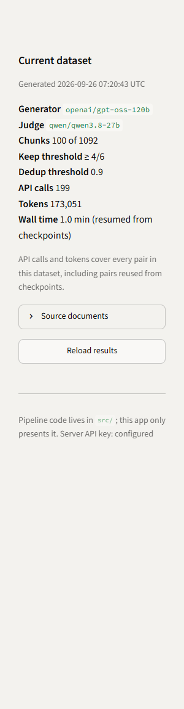
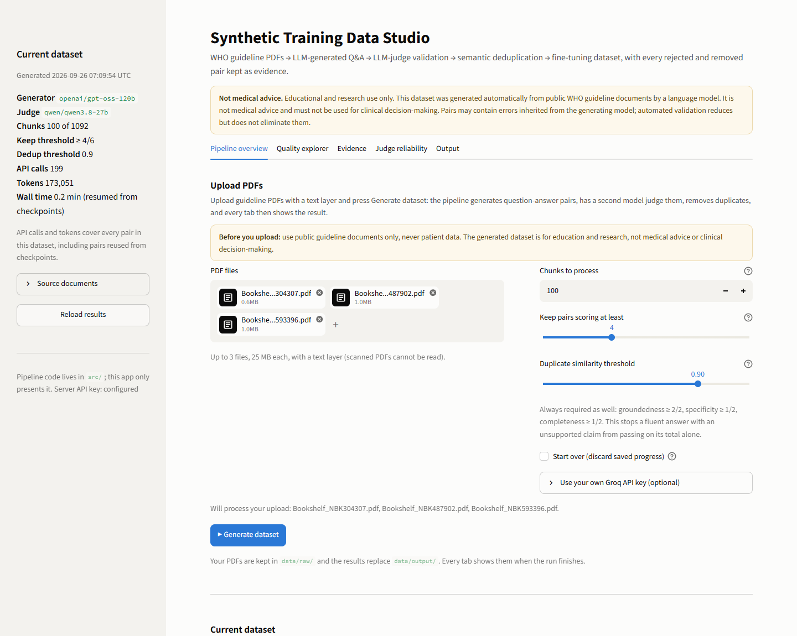
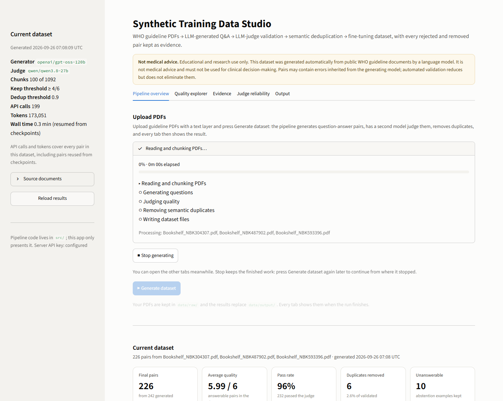
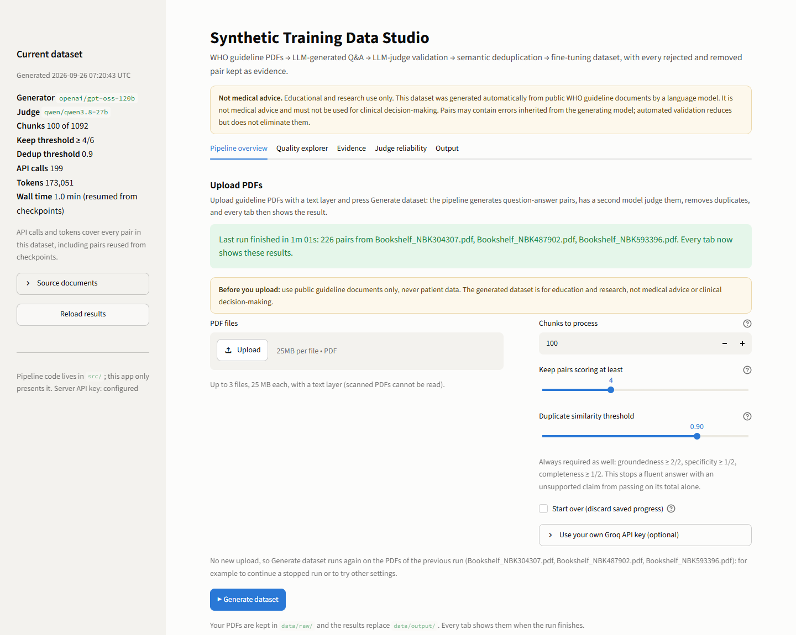
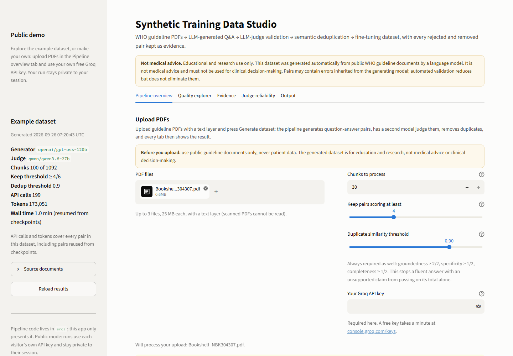

# Synthetic Training Data Studio: the complete guide

This file explains everything in the project: what it is for, how each step works, and what every section, button and number on the dashboard means. It was written from the code itself. The numbers come from the example dataset currently in `data/output/` (a 100-chunk run on three WHO guidelines). When you upload your own PDFs and generate a new dataset, the numbers on your screen change, but everything else here stays true.

> **Not medical advice.** The project and its dataset are for education and research only. The question-answer pairs are generated automatically from public guideline documents by a language model. They must not be used for clinical decisions. Validation reduces errors but does not remove them.

## Quick start (2 minutes)

1. Double-click **Synthetic Data Studio** on your desktop and press **▶ Start**. The dashboard opens in your browser.
2. On the **Pipeline overview** tab, under **Upload PDFs**, choose up to 3 public guideline PDFs.
3. For a first try, set **Chunks to process** to **10** (a few minutes, and only a small part of your daily free API quota). Leave the other settings as they are.
4. Press **▶ Generate dataset** and watch the progress. You can press **■ Stop generating** at any time; pressing Generate dataset again later continues.
5. When the green "Last run finished" message appears, every tab shows your new dataset. Download it with the buttons under the numbers, or from the **Output** tab.
6. When you are done, press **■ Stop** in the desktop window.

## Contents

- [Quick start](#quick-start-2-minutes)
- [Part 1. The big picture](#part-1-the-big-picture)
- [Part 2. How the pipeline works, step by step](#part-2-how-the-pipeline-works-step-by-step)
- [Part 3. The dashboard, section by section](#part-3-the-dashboard-section-by-section)
  - [Opening the dashboard (desktop Start / Stop)](#31-opening-the-dashboard-the-desktop-start--stop-panel)
  - [Header](#32-the-header)
  - [Sidebar](#33-the-sidebar)
  - [Tab 1: Pipeline overview (Upload PDFs + current dataset)](#34-tab-1-pipeline-overview)
  - [Tab 2: Quality explorer](#35-tab-2-quality-explorer)
  - [Tab 3: Evidence](#36-tab-3-evidence)
  - [Tab 4: Judge reliability](#37-tab-4-judge-reliability)
  - [Tab 5: Output](#38-tab-5-output)
  - [Private mode and public mode](#39-private-mode-and-public-mode)
- [Part 4. Reading the results correctly](#part-4-reading-the-results-correctly)
- [Part 5. Commands, settings, files and common messages](#part-5-commands-settings-files-and-common-messages)
- [Part 6. Glossary](#part-6-glossary)
- [Part 7. Test yourself](#part-7-test-yourself)

---

## Part 1. The big picture

### 1.1 What the project does, in one sentence

You upload PDF documents, and it automatically builds a clean question-answer dataset that can be used to fine-tune (further train) a language model. It then shows, with evidence, how good that dataset is. The example dataset that comes with the project was made from three WHO health guidelines.

```
your uploaded PDFs → clean text chunks → an LLM writes questions and answers → a second LLM (the "judge")
     scores them → near-duplicates are removed → dataset files + statistics → every dashboard tab
```

There is **one pipeline and one dataset**. You start every run in one place, the **Upload PDFs** section of the Pipeline overview tab, and every tab then shows the result of that run.

### 1.2 The problem it solves

- A company, hospital, school or research team often wants a chatbot that knows **their** documents: guidelines, manuals, policies.
- To teach (fine-tune) a language model this knowledge, you need thousands of example questions with correct answers. That is called **training data**.
- Writing those by hand is slow and expensive. Asking an LLM to write them is fast, but the LLM can make mistakes (**hallucinations**), write vague questions, or repeat itself.
- This project does the fast part (automatic generation) **and** the careful part (quality control), and it keeps every rejected or removed pair as evidence. You can see exactly what the quality control did and why.

### 1.3 Who it helps

| Who | How it helps them |
|---|---|
| People building a chatbot for one field (for example health education) | Turns their documents into ready-to-use training files (JSONL and ChatML) |
| Teams worried about data quality | Every pair has scores and a reason; rejected pairs and removed duplicates are saved, not hidden |
| Researchers | Shows how to measure an LLM judge against a human (Cohen's kappa), and how thresholds change results (experiments) |
| Teachers and trainers | Study questions generated from guidelines, with the exact page cited. A person must still review them. |
| Students and job seekers (you) | A complete, working example of a modern LLM data pipeline, from PDF to a deployed web app |

What it is **not**: it does not fine-tune a model itself (that is listed as future work), and its answers are not medical advice.

### 1.4 What you get at the end

The main result is `data/output/synthetic_dataset.jsonl`: one question-answer pair per line. A real line from the example dataset:

```json
{"question": "Did the Steering Group consider any declarations as a reason for a Guideline Group member to recuse themselves?",
 "answer": "No, the Steering Group did not consider any of the declarations to be a reason for a Guideline Group member to recuse themselves.",
 "source": "Bookshelf_NBK304307.pdf", "page": 8, "question_type": "factual", "answerable": true, "quality_score": 6}
```

The 7 fields:

| Field | Meaning |
|---|---|
| `question` | The question |
| `answer` | The answer, taken only from the document |
| `source` | Which PDF it came from |
| `page` | The exact PDF page, so anyone can check it |
| `question_type` | `factual`, `definitional`, `procedural` or `unanswerable` |
| `answerable` | `false` only for the deliberate "not in the document" questions |
| `quality_score` | The judge's score out of 6 (empty for unanswerable questions) |

The same pairs are also saved in **ChatML** format (`synthetic_dataset_chatml.jsonl`), the chat format that fine-tuning tools read. There the user message contains the source passage and the question, and the assistant message contains the answer:

```json
{"messages": [
  {"role": "user", "content": "Context:\n<the source passage>\n\nQuestion: <the question>"},
  {"role": "assistant", "content": "<the answer>"}]}
```

### 1.5 The source documents of the example dataset

The example dataset in `data/output/` was made from three public WHO guidelines from the NCBI Bookshelf. The project does not include these PDFs: its only input is what you upload. To reproduce the example, download them from the NCBI Bookshelf and upload them. (They are also still in the project's git history.)

| File | Guideline | Pages |
|---|---|---|
| `Bookshelf_NBK304307.pdf` | Guideline on HIV disclosure counselling for children up to 12 years of age (2011) | 47 |
| `Bookshelf_NBK487902.pdf` | Assessing and managing children at primary health-care facilities to prevent overweight and obesity in the context of the double burden of malnutrition (2017) | 88 |
| `Bookshelf_NBK593396.pdf` | Carbohydrate intake for adults and children (2023) | 100 |

They are © WHO and licensed CC BY-NC-SA 3.0 IGO, so the dataset made from them follows the same terms (non-commercial, share-alike, with credit).

### 1.6 The example dataset's results in one table

| What | Number |
|---|---|
| PDF pages with text | 228 (of 235) |
| Usable text chunks | 1,092 |
| Chunks processed in this run | 100 |
| Pairs generated | 242 (232 answerable + 10 unanswerable) |
| Passed the judge | 232 |
| After removing duplicates (final dataset) | **226** (216 answerable + 10 unanswerable) |
| Average quality of final answerable pairs | 5.995 / 6 (shown as 5.99) |
| API calls / tokens | 199 calls; 94,679 generator + 78,372 judge tokens |

---

## Part 2. How the pipeline works, step by step

All steps live in `src/`. The only function that runs the whole pipeline is `run_pipeline()` in `src/pipeline.py`. The dashboard's **Upload PDFs** section calls it, and so does the command line (`main.py`) if you prefer a terminal. It is the same pipeline, not a second one.

### Step 1: Ingest (read and cut the PDFs), `src/ingest.py`

1. **Load every PDF, one page at a time.** The page number becomes the citation, so a chunk never spans two pages.
2. **Skip unreadable PDFs.** A PDF with fewer than 200 characters of text in total is almost certainly a scanned image. It is skipped with a warning, because OCR is not included.
3. **Clean each page:**
   - remove page numbers and running headers or footers (the title repeated on every page)
   - remove icon-font symbols
   - rejoin lines broken in the middle of a sentence
   - repair typesetting hyphen breaks ("carbo - hydrate" becomes "carbohydrate")
4. **Cut into chunks** of about 600 characters (roughly 150 words) with an 80-character overlap. The overlap means a sentence on a boundary still appears whole in one chunk. Cuts prefer paragraph, then line, then sentence, then word breaks. Chunks under 100 characters are dropped as fragments.
5. **Filter boilerplate.** Reference lists, committee member lists, contents pages, licence text and number tables are real text from the document, so a judge would happily pass questions like "Which university is X from?". Those teach nothing useful. Six simple text signals catch them: a chunk is dropped if it has
   - more than 3 citation markers ("et al", "doi", "2002;56")
   - more than 2 "Surname AB," author patterns
   - more than 1 legal phrase ("copyright", "licence")
   - more than 4 contents entries ("Background 15")
   - half or more of its words capitalised
   - 40% or more of its tokens numeric
6. **Select the chunks for this run.** By default 100 chunks are used, not all 1,092, to stay within the free API limits. They are **not** the first 100, which would all be one PDF's front pages. Instead the 100 are shared among the PDFs in proportion to their size, and taken evenly spaced inside each PDF. The choice is always the same for the same settings.

Result in the example run: 235 pages → 228 with text → 1,092 usable chunks → 100 selected.

### Step 2: Generate (the LLM writes Q&A), `src/generate.py`

- **Model:** `openai/gpt-oss-120b` on Groq, temperature 0.4. Higher temperatures make more creative but less faithful answers. Lower ones make repetitive questions.
- **Per chunk:** it asks for **3** question-answer pairs. The prompt's main rules:
  1. The answer must come **only** from the passage, never from outside knowledge.
  2. Answers are 1–3 complete, self-contained sentences.
  3. Questions must be standalone and name their subject. They must never say "the passage".
  4. No generic questions like "What is this passage about?".
  5. Each pair is tagged with the type it truly is:
     - **factual:** a specific fact, number or recommendation
     - **definitional:** what a term means
     - **procedural:** how something is done
  6. Citation markers such as "(22)" are not copied.
  7. If the passage has no real content, the model returns nothing (`[]`).
- **Unanswerable questions:** 10% of chunks (10 of 100, chosen with a fixed random seed) also get one extra question. It is on the topic, but the passage does **not** answer it. Its answer is always the fixed sentence *"This information is not available in the provided document."*, set by the code rather than the model. These examples teach a fine-tuned model to say "I don't know" instead of inventing an answer.
- **Cleaning the model's output:**
  - Pairs with a question of 15 characters or fewer, or an answer of 25 characters or fewer, are dropped.
  - So are generic questions and repeated questions.
  - A question that says "the passage" is rewritten to say "the WHO guideline", so it still makes sense without the passage.
  - An unknown type is tagged "other".
  - At most 3 pairs are kept per chunk.
- **Each chunk ends with a status:**
  - `ok`: pairs made
  - `empty`: the model found no real content (22 of the example run's 100 chunks)
  - `filtered`: the model wrote pairs but none survived the cleaning
  - `failed`: the API calls failed after retries

### Step 3: Validate (the LLM judge scores every pair), `src/validate.py`

- **Judge model:** `qwen/qwen3.8-27b`, deliberately from a **different model family** than the generator. A model tends to favour its own writing style. In a test with deliberately broken pairs, the generator's own model family gave a bare "Yes." answer a perfect score, while this judge rejected it.
- **Temperature 0**, so the same pair gets the same score every time.
- **The rubric.** Each criterion is scored 0, 1 or 2, so the total is 0–6:

| Criterion | 0 | 1 | 2 |
|---|---|---|---|
| **Groundedness**: is every claim in the answer supported by the passage? | information absent from the passage, or contradicting it | mostly from the passage, but adds outside details | every claim traceable to the passage |
| **Specificity**: does the question test this particular content? | vague, fits almost any text | somewhat specific | tests specific content of this passage |
| **Completeness**: does the answer fully answer the question? | truncated, a bare yes/no, or does not answer | partial | fully answers |

- **One call per chunk.** All pairs from one chunk are judged together (the passage is sent once), but each pair gets its own scores. A pair missing from the reply is re-judged on its own.
- **The code recomputes the total** from the three sub-scores. It does not trust the model's arithmetic.
- **The keep rule.** A pair is kept only if **all** of these are true:
  - total ≥ **4**
  - groundedness = **2**
  - specificity ≥ **1**
  - completeness ≥ **1**

  Why the extra floors? With the total alone, 2 + 2 + 0 = 4 would pass. That could be a fluent, specific answer containing an **invented number**. For medical data, an unsupported claim is never acceptable.
- **Unanswerable questions** get a different check:
  - The code confirms the answer is exactly the fixed abstention sentence.
  - The judge confirms the passage really does not answer the question, and that the question is on topic.
- **A judge failure** (a call that still fails after retries) counts as rejected with score 0. It is never silently kept. The example run had 0 failures.
- **Results in the example run:** 232 pairs passed and 10 were rejected. All 10 had groundedness below 2.

### Step 4: Deduplicate (remove repeated facts), `src/deduplicate.py`

- **Why:** the same fact often appears twice in a guideline, for example in the main text and again in an annex. Two pairs teaching one fact waste training and over-weight that fact.
- **How:**
  1. Each pair's **question + answer** is turned into an **embedding** (a list of 384 numbers that captures meaning) by the small `all-MiniLM-L6-v2` model, running on the CPU.
  2. Two pairs whose embeddings have a **cosine similarity above 0.90** count as duplicates.
  3. Pairs are visited from highest score to lowest, so when two pairs match, the **better-scored one is kept**.
- **The number guard.** If both answers contain numbers and the numbers differ (for example "15 g for children" and "25 g for adults"), the pairs are **never** treated as duplicates. The embedding model barely notices digits.
- **Why question + answer and 0.90**, not the original spec's "question only, 0.85": on this data, question-only similarity put different facts about the same topic above 0.85, so it would have deleted real information (experiment 2 in Part 4).
- **Result in the example run:** 6 restatements removed. 232 → 226.

### Step 5: Export (write the files), `src/export.py`

It writes the dataset, the ChatML version, the audit trail and the statistics into `data/output/`. The full list is in [Tab 5: Output](#38-tab-5-output). The rejected and duplicate lists are written by their own steps (3 and 4); everything else is written here, at the very end. So a stopped run never leaves a half-written dataset.

### Behind the scenes

- **Rate limiting.** Groq's free tier allows about 8,000 tokens per minute and 30 requests per minute for each model, plus a daily cap of about 200,000 tokens. The code paces itself below these limits:
  - It waits at least 1 second between requests.
  - It only starts a call when the prompt plus the reply limit fits into this minute's budget.

  So it rarely gets "too many requests" errors.
- **Retries.** A failed call, or a reply that is not valid JSON, is retried up to 3 times, waiting 1, 2, then 4 seconds.
- **Errors that stop the run immediately** with a clear message:
  - a wrong API key (HTTP 401)
  - an unknown model name (404)
  - the daily quota used up
  - a request that is too large (413)
- **Checkpoints and resume.**
  - Finished chunks and judgements are saved to `data/cache/` every 25 items, and again whenever the run stops.
  - The next run with the same settings reuses them, skipping the finished work and its API cost.
  - A "fingerprint" of the settings, prompt and chunks makes sure saved work is reused only by an identical run.
- **Stop buttons are cooperative.** Pressing Stop does not kill the program:
  - During reading, generating or judging, the run stops after the current chunk or judge call and saves its progress. The dataset is not written.
  - Once judging has finished, the last two stages (deduplication and writing the files) take only seconds, so the run completes them instead of stopping.

  Either way, you never get a mix of old and new files.
- **A new dataset never mixes with the old one.**
  - Each upload replaces the previous run's PDFs in `data/raw/`, and the finished run replaces the results in `data/output/`.
  - If the new dataset is different, three kinds of file made for the old dataset move to `data/output/previous/<time>/`: your human labels (`human_labels.json`), the agreement results and the experiment tables. Nothing is deleted.
  - Re-running the same PDFs with the same settings moves nothing.
- **Prompt versions.** Each pair records which prompt made it. In the example dataset, 158 pairs come from prompt `gen-v2` and 84 from `gen-v3`. The newer version rewrites "the passage" instead of dropping the pair. The daily token cap prevented regenerating everything, so only the incomplete chunks were redone with the new prompt. Every pair generated from now on uses `gen-v3`.

### Follow one pair through the pipeline (a real example)

1. **Ingest:** page 11 of the HIV-disclosure guideline contains the passage "Reducing stigma should make disclosure easier and thus increase the uptake of treatment, adherence to medication, and coping with HIV-related symptoms and the side effects of treatment."
2. **Generate:** the model writes *Q: According to the WHO guideline, what three patient outcomes are expected to improve when stigma is reduced?* and *A: Reducing stigma is expected to increase the uptake of treatment, improve adherence to medication, and enhance coping with HIV‑related symptoms and the side effects of treatment.* It is tagged `factual`.
3. **Validate:** the judge gives groundedness 2, specificity 2, completeness 2, so the total is 6/6 and the pair is kept.
4. **Deduplicate:** no other kept pair is more than 0.90 similar, so it stays.
5. **Export:** it appears in the final dataset with `"page": 11` and `"quality_score": 6`.

---

## Part 3. The dashboard, section by section

### 3.1 Opening the dashboard: the desktop Start / Stop panel


Double-click **Synthetic Data Studio** on your desktop, or `Start Synthetic Data Studio.bat` in the project folder. A small window opens.

| Part | What it does |
|---|---|
| **Status light** | Green = Running, orange = Starting… or Stopping…, grey = Stopped |
| **Text under the status** | Explains the state, for example "Open at http://localhost:8501" |
| **▶ Start** (blue) | Opens the project in your web browser. If it is not running, it launches it first. That takes about 10 seconds, and up to a minute the first time while PyTorch loads. If it is already running, it just opens the page again. |
| **■ Stop** (red) | Shuts the project down straight away. It asks for confirmation ("Stop while generating?") only if a dataset is being generated at that moment, because stopping then loses the work since the last checkpoint (up to 25 chunks). Grey (disabled) when the project is stopped. |
| **Closing the window (X)** | If the project is running, it asks: **Yes** = stop it and close, **No** = keep it running and close, **Cancel** = do nothing |

The dashboard started this way listens only on your own computer (`localhost:8501`). Other devices on your Wi-Fi cannot open it.

### 3.2 The header

At the top of every page:

- **Title:** "Synthetic Training Data Studio".
- **Subtitle:** the pipeline in one line: WHO guideline PDFs → LLM-generated Q&A → LLM-judge validation → semantic deduplication → fine-tuning dataset, with every rejected and removed pair kept as evidence.
- **Yellow "Not medical advice" box:** the disclaimer. It is always visible.

### 3.3 The sidebar



The sidebar only **describes** the dataset the tabs are showing. Runs start in the Upload PDFs section (Tab 1), not here. It is headed **Current dataset**. In the public app it says **Example dataset** until a visitor's own run finishes, with a short "Public demo" note above it.

| Line | Meaning (example dataset's value) |
|---|---|
| Generated … UTC | When the results were written. This changes with every run, even a quick re-run that reuses saved work. |
| **Generator** | The model that wrote the pairs (`openai/gpt-oss-120b`) |
| **Judge** | The model that scored them (`qwen/qwen3.8-27b`) |
| **Chunks** | Chunks processed of those available (100 of 1092) |
| **Keep threshold** | The minimum total score (≥ 4/6); the floors apply as well |
| **Dedup threshold** | The similarity above which a pair is a duplicate (0.9) |
| **API calls** | All calls that produced this dataset (199) |
| **Tokens** | Generator + judge tokens (173,051) |
| **Wall time** | How long the last run took. "(resumed from checkpoints)" means it reused saved work, so it can take well under a minute. A fresh 100-chunk run takes about 25 minutes. |
| Caption | API calls and tokens include work reused from checkpoints, so they describe the whole dataset |
| **Source documents** (expander) | Click to list the PDF file names |
| **Reload results** (button) | Re-reads the results folder. Use it after running `main.py` in a terminal. |
| Bottom caption | "Pipeline code lives in `src/`…" and whether a server API key is configured |

### 3.4 Tab 1: Pipeline overview

**Purpose:** everything starts and ends here.
- **Top, "Upload PDFs":** where you run the pipeline.
- **Below, "Current dataset":** the result of the latest run at a glance, with one-click downloads.


#### A. "Upload PDFs": the one place a run starts

The steps:
1. Choose your PDFs.
2. Optionally change the settings.
3. Press **▶ Generate dataset**.
4. Watch the progress.
5. When the run finishes, **every tab** (Overview, Quality explorer, Evidence, Judge reliability, Output) shows the new dataset.



**Before you start:** the yellow **"Before you upload"** box says to use public guideline documents only, **never patient data**, and that the result is not medical advice.

| Control | What it does |
|---|---|
| **PDF files** (Upload button or drag and drop) | Choose up to **3 PDFs, 25 MB each**, with a text layer (scanned PDFs cannot be read). A small ✕ removes a file. The limits are settings in `config.yaml` (`web.max_files_per_run`, `web.max_upload_mb`). |
| **Chunks to process** (1–5,000, steps of 10, default 100) | How many passages of about 600 characters the run uses, spread evenly across your files (all of them if there are fewer). More chunks give more pairs but take longer: about 15 seconds per chunk on the free tier, so 100 chunks ≈ 25 minutes and close to half of each model's daily free token quota. |
| **Keep pairs scoring at least** (slider 3–6, default 4) | The judge's total a pair needs to be kept, for this run. Higher = fewer but better pairs. |
| **Duplicate similarity threshold** (slider 0.75–0.95, default 0.90) | Pairs more similar than this (comparing question and answer together) are duplicates; the higher-scored one is kept. Lower = more pairs removed. |
| Caption under the sliders | The floors always apply as well: groundedness ≥ 2/2, specificity ≥ 1/2, completeness ≥ 1/2 |
| **Start over (discard saved progress)** (tick box, off by default) | **Off:** work already done on the same PDFs, with the same number of chunks and the same settings, is reused, which is fast and free. This is also how a stopped run continues. **On:** the saved progress is deleted and everything is regenerated, spending a full run's quota and creating **new** pairs. Normally leave it off. |
| **Use your own Groq API key (optional)** | If left empty, the key in `.env` is used. A key you type here is kept in your browser session only, never saved to disk or logged. |
| **Caption above the button** | Says exactly what will be processed. One of: "Will process your upload: … It replaces the PDFs of the previous run (…)"; "No new upload, so Generate dataset runs again on the PDFs of the previous run (…)", used to continue a stopped run or try other settings; or "Choose one or more PDFs to begin." |
| **Red error messages** | For a file that is not a PDF, has a .pdf name but is not really a PDF, is empty or too big, or for too many files |
| **Yellow warning** | No API key is available (none in `.env` and none typed in) |
| **▶ Generate dataset** | Starts the run in the background. Disabled until there is something to process and a key. |
| **Caption under the button** | "Your PDFs are kept in `data/raw/` and the results replace `data/output/`. Every tab shows them when the run finishes." |

**What happens to your files:**
- The uploaded PDFs are saved in `data/raw/`, replacing the PDFs of the previous run. Only `.pdf` files there are removed; your original files on your computer are never touched.
- When the run finishes, its results replace `data/output/`.
- The command line (`main.py`) reads the same `data/raw/` folder, so it re-runs your last upload.

**Uploading documents that are not WHO guidelines?** The project is set up for WHO clinical guidelines, and that choice lives in `config.yaml`:

| Setting | Current value | What it affects |
|---|---|---|
| `generate.source_reference` | "the WHO guideline" | A question that would say "the passage" is rewritten to this, for example "According to the WHO guideline, …" |
| `domain.name` | "WHO clinical guidelines" | The generator and the judge are told the passage comes from this kind of document |
| `domain.system_role` | "an expert medical educator creating training data from WHO clinical guidelines" | The generator's role |

For other documents, change these three settings before you press Generate dataset. For example, use "the guideline", "clinical guidelines" and "an expert medical educator creating training data from clinical guidelines". Otherwise some questions will wrongly name WHO.

The disclaimer text and the Hugging Face dataset card also mention WHO; those are in `src/export.py`.

**While the run is going:**



| Element | What it shows |
|---|---|
| **Status box title** | The current stage: "Reading and chunking PDFs", "Generating questions: chunk 37/100", "Judging quality: pair 120/242", "Removing semantic duplicates", "Writing dataset files" |
| **Progress bar** | For example "45% · 3m 12s elapsed". It is weighted by how long each stage takes: reading 3%, generating 50%, judging 42%, deduplicating 3%, writing 2%. |
| **Checklist** | The five stages: ✓ done, ▸ current, ○ to do |
| **Processing: …** | The PDFs in this run |
| **■ Stop generating** | Stops after the current step. The title changes to "Stopping after the current step". Finished work is saved, so pressing **Generate dataset** again later (no new upload needed) continues from there. If you press Stop after judging has finished, the run completes its last few seconds instead. |
| Caption | You can open the other tabs while it runs |

**When it ends:**



- **A pop-up**, "Dataset ready: every tab now shows the new results.", and every tab refreshes by itself.
- **A green message:** "Last run finished in … : N pairs from <files>. Every tab now shows these results."
- **Yellow warnings,** if any. For example, a scanned PDF that was skipped, or "This is a new dataset, so human_labels.json, … (made for the previous dataset) moved to data/output/previous/<time>. Nothing was deleted."
- **If you stopped it:** a blue "The last run was stopped after … Press Generate dataset to continue it from where it stopped."
- **If it failed:** a red "The last run could not finish." with the reason, for example a wrong API key or a used-up daily quota.

These messages stay visible, in every browser window of the dashboard, until the dashboard is restarted.

#### B. "Current dataset"

Below a divider line, the heading **Current dataset** and a line such as "226 pairs from Bookshelf_NBK304307.pdf, … · generated <time> UTC". In the public app, until a visitor has made their own dataset, this says **Example dataset**, with a note that the visitor is viewing the example made from three WHO guidelines.

#### The five tiles (example dataset's values)

| Tile | Example value | Small text | What it means, exactly |
|---|---|---|---|
| **Final pairs** | 226 | from 242 generated | Pairs in the final dataset after judging and deduplication (216 answerable + 10 unanswerable). 242 is everything the generator produced. |
| **Average quality** | 5.99 / 6 | answerable pairs in the dataset | The mean judge score of the 216 answerable pairs in the final dataset (215 scored 6 and one scored 5, so 5.995). It is **cut** to two decimals, not rounded, so a 5.995 never shows as a perfect 6.00. |
| **Pass rate** | 96% | 232 passed the judge | Pairs that passed ÷ pairs generated = 232 ÷ 242 = 95.9%. The 232 include the 10 unanswerable questions that passed their check. |
| **Duplicates removed** | 6 | 2.6% of validated | Pairs removed because they restated a fact already kept. 6 ÷ 232 = 2.6%. |
| **Unanswerable** | 10 | abstention examples kept | "Not in the document" questions in the final dataset |

#### One-click downloads (the row of buttons under the tiles)

| Button | File you get |
|---|---|
| **Dataset (JSONL)** | `synthetic_dataset.jsonl`, the final dataset |
| **Dataset (CSV)** | The same pairs as a spreadsheet that opens in Excel |
| **ChatML for fine-tuning** | `synthetic_dataset_chatml.jsonl` |
| **Everything (ZIP)** (blue) | Every output file in one ZIP |

The **Output** tab has every file separately, with previews.

#### Chart: "From raw generations to the final dataset" (funnel)

Three bars: **Generated 242 → Passed judge 232 → After dedup 226**. Each bar shows the count and its share of the generated pairs. The message: every stage removes pairs for a stated reason, and nothing is silently dropped.

#### Chart: "Pairs per source document"

How many final pairs came from each PDF: `NBK593396` (carbohydrate) 86, `NBK487902` (child obesity) 84, `NBK304307` (HIV disclosure) 56. The HIV guideline is the smallest document, so it got fewer chunks.

#### Chart: "Question types"

Final dataset by type, with the share of the dataset:

| Type | Pairs | Share |
|---|---|---|
| factual | 166 | 73% |
| definitional | 31 | 14% |
| procedural | 19 | 8% |
| unanswerable | 10 | 4% |

The dataset leans factual because guidelines mostly state facts and recommendations. The model tags each pair with its true type rather than forcing one of each.

#### Chart: "How questions open"

The subtitle says: 19 distinct opening words, and the most common, "what", starts 46% of questions. The bars show the top 8 first words:

| Word | Share |
|---|---|
| what | 46% |
| according | 16% |
| how | 12% |
| which | 9% |
| why | 3% |
| in | 3% |
| who | 2% |
| when | 2% |

**Why it matters:** a dataset where most questions start the same way teaches the model only one question shape, even if every pair scores well. "According" comes from the rewrite "According to the WHO guideline, …".

#### "View as table" (under every chart)

Opens the chart's numbers as a table, for exact values or for readers who cannot use the colours.

#### Expander: "Run log: timings, usage and warnings"

| Row | Example value | Meaning |
|---|---|---|
| Chunks processed / available | 100 / 1092 | |
| Chunks failed / no substantive content / fully filtered | 0 / 22 / 0 | Failed = API errors. No substantive content = the model returned no pairs, because the passage had nothing worth asking. Fully filtered = the model wrote pairs, but all were cleaned away. |
| Pairs by generation prompt version | gen-v2: 158, gen-v3: 84 | Which prompt made the pairs (see Part 2) |
| Generation time / Validation time | about 0 min | The **latest** run reused saved work, so these are near zero. A fresh 100-chunk run takes about 25 minutes. |
| Tokens (generation / validation) | 94,679 / 78,372 | |
| Judge failures | 0 | |

Any warnings from the run (for example a skipped scanned PDF) appear below the table.

### 3.5 Tab 2: Quality explorer

**Purpose:** browse every judged pair, filter it, and see its scores and the judge's comments. It shows every **answerable** pair that was judged, including the rejected ones and the duplicates (232 in the example). The unanswerable questions are in Tab 3.


#### Controls

| Control | Default | What it does |
|---|---|---|
| **Minimum quality score** (slider 0–6) | 2 | Only pairs with a judge total at or above this are listed. Drag it from 2 to 5 to see vague and partly unsupported pairs drop out. This slider only filters the view; it does not change the dataset. |
| **Search questions and answers** | empty | Shows pairs whose question or answer contains your text (upper or lower case does not matter), for example "fibre" |
| **Source** | all PDFs in the dataset | Remove a PDF to hide its pairs |
| **Question type** | all | factual / definitional / procedural |
| **Status** | all three | **kept** = in the final dataset; **duplicate** = passed the judge but removed as a restatement; **rejected** = failed the keep rule |
| **Passages** (switch) | off | On: shows the source passage under every pair, so you can check the answer yourself |

#### Chart: "Quality score distribution"

- One bar per score, 0 to 6, counting all judged answerable pairs **before** deduplication. In the example: score 3 → 2 pairs, 4 → 3, 5 → 6, 6 → 221.
- **Blue** bars are shown by your slider; **grey** bars are hidden by it.
- The **vertical line** marks "pipeline keeps ≥ 4". The subtitle reminds you the floors also apply, so a few pairs at or above the line were still rejected. For example, a 5/6 pair with groundedness 1.

#### The three tiles on the right

| Tile | Meaning |
|---|---|
| **Pairs at this threshold** | How many judged answerable pairs score at or above the slider. It ignores the other filters. |
| **Matching all filters** | How many pairs pass every filter; these are listed below |
| **Average score shown** | The mean score of the listed pairs (cut to 2 decimals) |

#### The list of pairs

- The heading shows the number of pairs, sorted by score (highest first), then alphabetically.
- **20 per page.** A **Page** box appears when there is more than one page.
- **Each card shows:**
  - **Status pill:** ✓ Kept (green), ✕ Rejected (red) or ⧉ Duplicate (grey)
  - **Score pill** (blue), for example "Score 6/6"
  - **Type pill:** factual / definitional / procedural
  - **Source file and page**
  - The **question** (bold) and the **answer**
  - **Three score bars:** Groundedness, Specificity, Completeness, each out of 2
  - **"Judge:"** followed by the judge's reason, when a criterion was below 2
  - The **passage** (when the Passages switch is on)
- If nothing matches: "No pairs match these filters. Lower the minimum score or clear the search."

**Try this (on the example dataset):** set the slider to 5, turn Passages on, and set Status to only "rejected". You will see the 5 pairs that scored 5/6 but were rejected for groundedness 1. Compare each answer with its passage.

### 3.6 Tab 3: Evidence

**Purpose:** prove the quality control worked by showing what it removed and why.


#### "What the judge rejected, and why"

- **Subtitle** (example numbers): "10 answerable pairs were rejected: scored below 4/6, or missed a per-criterion floor (groundedness ≥ 2, specificity ≥ 1, completeness ≥ 1). Each keeps the judge's stated reason."
- **Bar chart:** how many rejected pairs scored below 2 on each criterion. In the example: **Groundedness 10, Completeness 5, Specificity 2.** One pair can count in more than one bar. The main problem was answers adding details the passage does not state.
- **Left column, "Rejected · lowest scores first":** the 5 worst, then **"Show all N rejected pairs"** for the rest. A real example: "What is the reported effect size estimate and its 95% confidence interval…", scored 1/1/1. The judge's reason: it gives the estimate after a sensitivity analysis, not the main one, and the question is vague about which result it means.
- **Right column, "Kept · top scores, across all documents":** 5 examples of good pairs, taken in turn from each PDF so all documents are represented.

#### "Semantic duplicates removed"

- **Subtitle:** how many pairs restated a fact already kept (6 in the example), because the similarity of their question and answer was above 0.9. Pairs whose answers state different numbers are never merged.
- **Each card shows two pills:**
  - **Semantic similarity:** the embedding similarity (in the example: 0.99, 0.99, 0.95, 0.94, 0.90, 0.90)
  - **Lexical overlap of questions:** how much the question *wording* overlaps. A low value with a high semantic similarity shows a rewording that simple text matching would miss.
- **Two sides:** **Removed** on the left and **Kept (duplicate of)** on the right, each with its question, answer, source and page. Up to 12 are shown.
- **Example:** the same "integrate the recommendations into health promotion activities" answer appears on page 93 and page 34 of the carbohydrate guideline. The copy on page 93 was removed.

#### "Unanswerable questions: teaching the model to abstain"

- It explains why these exist: a model trained only on answerable questions learns that every question has an answer, and invents one when it doesn't know.
- **Each card shows:**
  - a **verdict pill:** ✓ Kept if the judge confirmed the question is truly unanswerable and on topic, otherwise ✕ Rejected
  - the source and page
  - the question
  - the fixed answer, in italics
- Up to 10 are shown. All 10 in the example passed.
- **Example:** "What is the recommended frequency for viral load monitoring in children receiving antiretroviral therapy according to these guidelines?" The disclosure guideline does not say, so the answer is "This information is not available in the provided document."

#### "Download"

| Button | File |
|---|---|
| **Dataset (JSONL)** | `synthetic_dataset.jsonl` |
| **ChatML for fine-tuning** | `synthetic_dataset_chatml.jsonl` |
| **All outputs + evidence (ZIP)** | every output file in one ZIP |

### 3.7 Tab 4: Judge reliability

**Purpose:** check whether the AI judge can be trusted, by comparing it with a **human** (you).

**Why it matters:** without this, the quality numbers are circular. The project would be reporting its own judge's opinion of its own generator. The rule is that **a person** must enter these scores. The AI never fills them in.

#### How the check works

1. The app picks a **blind sample of 40 pairs**. "Blind" means the judge's scores are hidden from you.
2. The sample is **stratified**: spread across the judge's score bands (0–2, 3, 4, 5, 6). Otherwise it would be almost all 6s, and the important keep/reject boundary would go untested. The current sample (for the example dataset) holds every pair the judge scored below 6 (2 at 3/6, 3 at 4/6, 6 at 5/6) plus 29 pairs at 6/6, shuffled. It uses a fixed seed (42), so the sample is reproducible.
3. You score each pair on the same three criteria.
4. **Cohen's kappa (κ)** measures how much you and the judge agree **beyond chance**:

| κ | Meaning |
|---|---|
| above 0.8 | strong |
| 0.6–0.8 | substantial |
| 0.4–0.6 | moderate |
| below 0.4 | weak |

A κ of 0 means no better than guessing.


#### What you see while labelling

| Element | What it does |
|---|---|
| **Create labelling sample (40 pairs)** | Only shown if no sample exists yet. It creates `data/output/human_labels.json`. |
| **"Your task"** text | Score all 40. Every click is saved, so you can stop and continue later. |
| **How to score** (expander, open at the start) | The scoring guide. Groundedness: is everything the answer says stated in the passage? Specificity: does the question test *this* passage? Completeness: does the answer fully answer it? A correct, complete answer to a specific question is 2 / 2 / 2, and most pairs will be. |
| **Your name (recorded in the labels file)** | Optional. It is saved in `human_labels.json`, and that file is in git, so it becomes public if you push the project. |
| **Jump to a pair (✓ = labelled)** | A drop-down list of all 40; ✓ = done, ○ = not yet |
| **"Pair N of 40 · not labelled yet"** | Which pair you are on, and whether it is done |
| **Progress bar** | "k of 40 labelled" |
| **The card** | Source and page, the passage (read it first), then the question and the answer |
| **Three choice groups** | **Groundedness:** "0 · info absent from passage", "1 · mixes in outside knowledge", "2 · fully traceable". **Specificity:** "0 · vague / generic", "1 · somewhat specific", "2 · tests this content". **Completeness:** "0 · truncated or yes/no", "1 · partial", "2 · fully answers". |
| **Notes (optional)** | Your comment on the pair |
| **Save and go to next** | Saves to the file and moves to the next unlabelled pair. A pop-up confirms "Saved pair N (k of 40 labelled). Showing pair M." If one criterion is not chosen, it asks you to choose all three. |
| **Warning** (after 5 or more labels) | Appears if every pair got identical scores, or if one criterion never varies. Kappa cannot measure agreement when one rater never changes their answer. |
| **Preliminary agreement** (expander, after 2 or more labels) | The results so far |
| **Start again: clear my labels** (expander) | Tick **"Yes, delete my labels"**, then press **Clear my labels**. It wipes your scores and notes; the same 40 pairs stay. |

#### What you see when all 40 are labelled

- A green "All 40 pairs are labelled" message and **where the outputs are**:
  - `human_labels.json`: your labels
  - `judge_agreement.json`: the results, also printed by `python -m src.agreement score`
  - the README table: run `python -m src.experiments`
- **Tiles:**
  - **Keep/reject κ:** do you and the judge agree on which pairs to keep? Both sides use the same keep rule (total ≥ 4 plus the floors).
  - **Groundedness κ, Specificity κ, Completeness κ:** each with its band and "% exact agreement".
- **A plain-language verdict,** for example "Agreement is weak: the judge's scores should not be taken as evidence of quality on their own…"
- **"Keep/reject decisions" heat map:** rows = your decision, columns = the judge's, each cell = number of pairs. The diagonal (top-left and bottom-right) is where you agree.
- **"Per-criterion agreement" table:**
  - **Cohen's κ**
  - **Weighted κ:** gives partial credit when you are only 1 point apart
  - **Exact agreement %**
  - **Band**
  - plus a **Keep / reject** row
- **Mean total score:** your average versus the judge's.
- A "–" instead of a number means κ is undefined, because both of you gave one identical score to everything.
- **Review or change your labels** (expander) and **Start again** are still available.

#### Your current status (important)

All 40 of your current labels are **1 / 1 / 1**, so the tab shows a warning and a κ of 0.0. That number says nothing about the judge. Please open **Start again: clear my labels**, clear them, and score each pair honestly. In the public version of the app, the results stay hidden until the labels are complete and varied.

**When you generate a different dataset,** the labels belong to the old one. They move to `data/output/previous/<time>/` together with the old agreement results (nothing is deleted), and this tab then offers **Create labelling sample (40 pairs)** for the new dataset. The human check is always about the dataset you are looking at.

### 3.8 Tab 5: Output

**Purpose:** download any result file of the current dataset to your computer.


- **Dataset line:** "**Current dataset:** 226 pairs from 3 PDFs · average quality 5.99 / 6 · saved in `data/output/`".
- **Download everything (ZIP):** every file below in one ZIP, named `synthetic_dataset_outputs_<date>.zip`.
- **Individual files:** one card per file, with its title, what it contains, the file name, its size and row count, the last update time, and a **Download** button. A file that does not exist yet shows "Not created yet: made by …" (for example the Judge reliability tab, or `python -m src.experiments`) and a grey **Not available** button.

| File | What it is (numbers from the example) |
|---|---|
| `synthetic_dataset.jsonl` | **The final dataset**: 226 clean pairs, 7 fields each |
| `synthetic_dataset.csv` | The same pairs as a spreadsheet that opens in Excel. It is made when you click, and handles special characters (µ, ≥) correctly. |
| `synthetic_dataset_chatml.jsonl` | The same pairs in chat format for fine-tuning tools (TRL, Axolotl, Hugging Face), with the passage included |
| `judged_pairs.jsonl` | **Full audit trail**: all 242 pairs with sub-scores, the judge's note, and status (kept 226 / rejected 10 / duplicate 6) |
| `rejected_pairs.jsonl` | The 10 rejected pairs with the judge's reasons |
| `duplicate_pairs.jsonl` | The 6 removed duplicates next to the pair each one repeated, with the similarity |
| `unanswerable_pairs.jsonl` | The 10 unanswerable questions with the verification verdict |
| `pipeline_stats.json` | Every count and distribution, plus the exact settings used |
| `human_labels.json` | The 40-pair blind sample with your scores |
| `judge_agreement.json` | The kappa results (written when all pairs are labelled) |
| `experiments.md` | The four experiment tables, ready to paste into the README |
| `experiments.json` | The same experiment results for programs |

- **Preview a file:** pick any JSONL file to see its first 200 records as a table. The long passage column is hidden, and ChatML is shown as user/assistant columns.

Files are prepared only when you click a button, so the page stays fast.

### 3.9 Private mode and public mode

The same app behaves differently depending on who opens it. Either way there is one pipeline; what differs is **whose** dataset a run replaces.



| | Private (you, via the desktop Start button) | Public (the internet, e.g. Streamlit Cloud) |
|---|---|---|
| When | The server listens only on your computer **and** the page is opened on your computer | Every other case (automatic, so a deployment is safe) |
| What the tabs show | Your one dataset (`data/output/`) | The **example dataset** until the visitor's own run finishes, then the visitor's own dataset |
| Upload PDFs | Your key is optional (it falls back to `.env`); up to 5,000 chunks; "Start over" is available; a run replaces `data/raw/` and `data/output/` | The visitor must enter **their own key** (yours is never used), at most 30 chunks per run, and the run stays in the visitor's own folder (`data/uploads/<visitor>/`), invisible to everyone else |
| Sidebar | "Current dataset" | "Public demo" note, then "Example dataset" or "Current dataset" |
| Judge reliability | Labelling form and results | Read-only. The example's results appear only once your labels are complete and valid. For a visitor's own dataset it explains that the human check is done locally. |
| Output | Files of your dataset | Files of the dataset being shown |

The setting is `web.public_mode: auto` in `config.yaml` (it can also be forced to `true` or `false`).

---

## Part 4. Reading the results correctly

### 4.1 Why are the scores so high (5.99 / 6)?

Partly for real reasons:

- a strong generator
- a strict prompt
- boilerplate removed before generation

Partly, perhaps, because **the judge is lenient**. 221 of the 232 judged pairs scored 6/6, and a manual spot check found one 6/6 pair that changed the passage's "priority *may vary*" into "authorities *should adjust*". That is exactly what the human check (Tab 4) is for. **Until your honest labels are in, treat the quality numbers as the judge's opinion, not a proven fact.**

### 4.2 The four experiments (`python -m src.experiments`, no API calls)

1. **Keep-rule test.**
   - With the original rule (total ≥ 4 only), **8 pairs** the judge itself found partly unsupported would have been kept. With the floors, 0 are kept, at almost no cost in size.
   - **Planted-defect test** (a one-off test described in the README; `src.experiments` does not repeat it). The judge scored one real pair and four deliberately broken ones. The total-only rule wrongly kept three of the broken ones:
     - an added claim (0/2/2)
     - a wrong number (0/2/2)
     - a bare "Yes." (2/2/0)

     The floors rejected all four.
2. **Deduplication test.** The spec's setting (question only, 0.85) removed 27 pairs, and reading them showed several were **different facts**, for example the age ranges of two different studies. In a 1-page upload test it even merged fibre advice for children aged 2–5 years with fibre advice for adults. The setting used (question + answer, 0.90, number guard) removed 6, all true restatements.
3. **Judge reliability.** Needs your honest labels (Tab 4). It is pending.
4. **Diversity.** 73% factual, 46% of questions start with "what", 16% with "According to…". Deduplication barely changed these shares.

These tables describe the example dataset. After you generate a new dataset, run `python -m src.experiments` again to make them for yours; the old tables are kept in `data/output/previous/`.

### 4.3 Limitations (know these before presenting the project)

- The judge's leniency is unmeasured until the human labels are done.
- Validation reduces errors but cannot guarantee zero.
- Each pair comes from one small passage (about 600 characters), so facts spread over several pages, and tables, are under-represented.
- The example dataset mixes two prompt versions (gen-v2: 158 pairs, gen-v3: 84).
- The filters and thresholds were tuned on the three WHO documents; check the results on new documents (the Evidence tab is made for that).
- The prompts are set up for WHO guidelines (see "Uploading documents that are not WHO guidelines?" in Tab 1).
- On the free tier, a 100-chunk run uses close to half of each model's daily token quota, so the full 1,092 chunks would need several days or a paid tier.
- There is no OCR (scanned PDFs are skipped), and it works in English only.

---

## Part 5. Commands, settings, files and common messages

### 5.1 Commands (run in the project folder)

```
venv\Scripts\pythonw.exe launcher.py                   # the Start / Stop window (same as the desktop icon)
venv\Scripts\python.exe main.py --max-chunks 5         # quick test run on data/raw (your last upload), about 1 minute
venv\Scripts\python.exe main.py                        # 100 chunks (about 25 minutes)
venv\Scripts\python.exe main.py --resume               # continue an interrupted run
venv\Scripts\python.exe -m pytest -q                   # 44 offline tests, no API key needed
venv\Scripts\python.exe -m src.agreement score         # kappa from your labels
venv\Scripts\python.exe -m src.experiments             # experiment tables (no API calls)
venv\Scripts\python.exe -m streamlit run dashboard/app.py --server.address localhost   # dashboard, private
```

Options of `main.py`:

| Option | What it does |
|---|---|
| `--max-chunks N` or `all` | How many chunks to process |
| `--min-quality-score N` | Keep threshold, 0–6 |
| `--similarity-threshold X` | Dedup threshold, 0–1 |
| `--resume` | Reuse saved progress from an identical run |
| `--refill` | After a prompt change: keep complete chunks, regenerate the rest |
| `--set key=value` | Change any setting, e.g. `--set generate.questions_per_chunk=2` |
| `--pdf-dir` / `--output-dir` | Other input / output folders |
| `--push-to-hub user/repo` (+ `--public`) | Upload the dataset to Hugging Face; only when you ask for it, private unless `--public` |

### 5.2 Settings (`config.yaml`)

Every adjustable value lives in this one file; nothing is hard-coded.

| Section | Key settings (current value) |
|---|---|
| `model` | generator `openai/gpt-oss-120b`, judge `qwen/qwen3.8-27b`, temperatures 0.4 / 0.0, reply limits 1024 / 512 tokens, 3 retries, 1 s between requests, 30 requests and 8,000 tokens per minute |
| `domain` | "WHO clinical guidelines" and the generator's role description |
| `paths` | `data/raw`, `data/cache`, `data/output`, `data/uploads` |
| `ingest` | chunk size 600, overlap 80, minimum chunk 100 characters, minimum 200 characters per PDF, and the six boilerplate-filter thresholds |
| `generate` | 3 questions per chunk; types factual / definitional / procedural; 10% unanswerable; the abstention sentence; "the WHO guideline" as the source name |
| `validate` | keep total ≥ 4; floors groundedness 2, specificity 1, completeness 1; passage limit 800 characters; one judge call per chunk |
| `deduplicate` | model `all-MiniLM-L6-v2`; compare question + answer; threshold 0.90; number guard on |
| `export` | put the passage in the ChatML user message |
| `agreement` | sample 40 pairs, seed 42 |
| `run` | 100 chunks by default; checkpoint every 25; seed 42 |
| `web` | 25 MB per file and 3 files per run for Upload PDFs; 30 chunks per run for public visitors; public mode `auto` |

The API key is **not** in `config.yaml`. It lives in `.env` (`GROQ_API_KEY=…`), which is never shared or committed.

### 5.3 Where everything lives

| Path | What it is |
|---|---|
| `data/raw/` | The PDFs of your last upload, which are the input of the next run. It is empty until you upload; it is never committed to git. |
| `data/output/` | The results of the latest run (the files in the Output tab); `previous/` inside it keeps labels and tables from earlier datasets |
| `data/cache/` | Saved progress (checkpoints), server log |
| `data/uploads/` | Public visitors' own folders (PDFs, progress, results). It also holds 4 folders from the old separate upload feature, including your 30-chunk job; the app no longer uses them, so you can keep or delete them. |
| `src/` | The pipeline: `ingest`, `generate`, `validate`, `deduplicate`, `export`, `pipeline`, `llm` (API calls, rate limits, retries), `agreement` (kappa), `experiments`, `uploads`, `config` |
| `dashboard/app.py` | The dashboard (presentation only; it calls `src/`) |
| `launcher.py` | The desktop Start / Stop window |
| `main.py` | The command-line entry point |
| `tests/test_pipeline.py` | 44 tests that run offline, using a fake LLM |
| `config.yaml` | All settings |
| `README.md` | The project write-up, including deployment steps |

### 5.4 Common messages and what to do

| You see | What it means | What to do |
|---|---|---|
| **▶ Generate dataset** is greyed out | There is nothing to process yet (no upload, and no PDFs from a previous run), a red upload error is showing, or no API key is available | Choose PDFs; fix or remove the file named in the red error; put `GROQ_API_KEY` in `.env` or type a key |
| "'x.pdf' is not a PDF file." · "… has a .pdf name but its content is not a PDF." · "… is empty." · "… is N MB; the limit is 25 MB per file." · "Too many files: … the limit is 3 per run." | An upload check failed | Remove that file, or split the upload into several runs |
| Yellow: "'x.pdf' has N page(s) but only M characters of text. It is probably a scanned image … Skipped." | That PDF has no text layer; the other PDFs are still processed | Use a PDF with selectable text, or run OCR on it first |
| Red: "None of the PDFs contained extractable text …" | Every PDF was a scan | As above |
| Red: "Groq rejected the API key (HTTP 401). Check GROQ_API_KEY in .env." | The key is wrong or expired | Make a new key at console.groq.com/keys and put it in `.env`, or type it into the key box |
| Red: "The daily Groq quota for '…' is used up. …" | You reached the free daily token limit | Wait until the quota resets, then press **Generate dataset** again: the finished work is reused |
| Red: "Groq does not recognise the model id '…' (HTTP 404). …" | Groq renamed or removed a model | Check console.groq.com/docs/models and update `model.id` / `model.judge_id` in `config.yaml` |
| Red: "The model produced no usable question-answer pairs: …" | Every chunk failed or had no real content (only references, names, a contents list) | Upload documents with more body text, or use more chunks |
| Yellow: "This is a new dataset, so human_labels.json, … (made for the previous dataset) moved to data/output/previous/<time>. Nothing was deleted." | Your labels belonged to the previous dataset | If you want a human check of the new dataset, press **Create labelling sample** in the Judge reliability tab |
| Red: "The app could not load its machine-learning libraries: …", or a run error mentioning "Failed to load PyTorch C extensions" | PyTorch did not load in this app session (the message shows the first cause). A library that failed to load cannot be reloaded while the app is running. | Restart the app: in the desktop window press **■ Stop**, then **▶ Start** (on Streamlit Cloud: Manage app → Reboot app). Your data is safe. |
| Numbers did not change after running `main.py` in a terminal | The page has not redrawn since the files changed | Press **Reload results** in the sidebar (or refresh the browser page) |
| The page does not open at http://localhost:8501 | The dashboard is not running | Press **▶ Start** in the desktop window and wait (up to a minute the first time) |

---

## Part 6. Glossary

| Term | Plain meaning |
|---|---|
| **LLM** | Large language model: an AI that reads and writes text (for example GPT, Llama, Qwen) |
| **Fine-tuning** | Further training an existing LLM on your own examples so it learns your field |
| **SFT** | Supervised fine-tuning: fine-tuning on question → answer examples |
| **Synthetic data** | Training data written by an AI instead of people |
| **Hallucination** | When an AI states something that is not true or not in its source |
| **Chunk** | A small piece of a document (here about 600 characters) |
| **Prompt** | The instructions sent to the LLM |
| **Temperature** | How random the LLM's writing is; 0 = always the same answer |
| **Token** | The unit an LLM reads and writes, roughly 3/4 of a word; APIs count usage in tokens |
| **Rate limit** | The maximum usage a provider allows per minute or per day |
| **Groq** | The company whose API runs the two LLMs used here |
| **LLM-as-judge** | Using an LLM to score another LLM's output |
| **Rubric** | A fixed scoring guide (here: groundedness, specificity, completeness, each 0–2) |
| **Groundedness** | Whether every claim in the answer is supported by the source passage |
| **Floor** | A minimum score one criterion must reach, whatever the total is |
| **Embedding** | A list of numbers that represents the meaning of a text; similar meanings give similar lists |
| **Cosine similarity** | A number from −1 to 1 saying how alike two embeddings are; near 1 = same meaning |
| **Deduplication** | Removing entries that repeat the same information |
| **Abstention** | Answering "this is not in the document" instead of guessing |
| **Cohen's kappa (κ)** | A measure of how much two raters agree beyond what chance would give; 1 = perfect, 0 = chance |
| **Weighted kappa** | Kappa that gives partial credit to near-misses (for example 1 vs 2) |
| **Confusion matrix** | A 2 × 2 table of how the two raters' keep/reject decisions line up |
| **Stratified sample** | A sample drawn evenly from different groups (here, score bands) |
| **JSONL** | A text file with one JSON record per line; the usual format for training data |
| **ChatML** | A chat format of messages with roles (user, assistant) used by fine-tuning tools |
| **Checkpoint** | Saved progress, so a stopped run can continue without redoing work |
| **Streamlit** | The Python library used to build the dashboard web app |

---

## Part 7. Test yourself

1. **What does the project produce?** A validated, deduplicated question-answer dataset (JSONL and ChatML) from PDF documents, plus evidence files and statistics.
2. **Why two different LLMs?** One generates the pairs; the other judges them. The judge is from a different model family to avoid self-preference bias. In testing, the generator's own family passed broken pairs that this judge rejected.
3. **What is the exact keep rule?** Total ≥ 4 out of 6 **and** groundedness 2, specificity ≥ 1, completeness ≥ 1.
4. **Why not just "total ≥ 4"?** Because 2 + 2 + 0 or 0 + 2 + 2 also make 4. That would keep a fluent answer with an invented fact. The experiment showed 8 such pairs would have been kept.
5. **Why is the pass rate 96%?** 232 of 242 generated pairs passed: 222 of 232 answerable pairs, plus all 10 unanswerable ones.
6. **Why does "Average quality" show 5.99 and not 6.00?** The true value is 5.995 (215 pairs at 6 and one at 5), and the dashboard cuts instead of rounding, so it never pretends to be perfect.
7. **What does deduplication compare, and why?** The question and the answer together, at similarity above 0.90, and never merging answers with different numbers. Comparing questions only would delete different facts about the same topic.
8. **What are unanswerable questions for?** To teach a model to say "not in the document" instead of inventing an answer. That is also why the ChatML format includes the passage.
9. **What does Cohen's kappa tell you, and why can't your current labels be used?** How much you and the judge agree beyond chance. Your labels are all 1/1/1, and when one rater never varies, kappa is 0 by construction, which says nothing about the judge.
10. **What happens when you press Stop during a run?** It stops after the current chunk or judge call, keeps finished work in checkpoints, writes no half-finished dataset, and the next run continues from where it stopped. After judging, the last few seconds are completed instead.
11. **Why only 100 chunks?** The free API tier allows about 200,000 tokens per model per day, and 100 chunks already use about 95,000 generator and 78,000 judge tokens, close to half. 100 chunks prove the pipeline without using up the quota.
12. **Where does a run start, and what does it replace?** Always in **Pipeline overview → Upload PDFs**; there is only one pipeline. The uploaded PDFs replace the previous run's PDFs in `data/raw/`, and the finished results replace `data/output/`, so every tab shows the new dataset. If it is a different dataset, the old human labels and tables move to `data/output/previous/`, and nothing is deleted.
13. **What stops a public visitor from using your API key or replacing your dataset?** Public mode. The server key is never used there, so the visitor must enter their own. Their run stays in their own folder, so everyone else still sees the example dataset.
14. **Is the dataset medical advice?** No. It is for education and research only.
